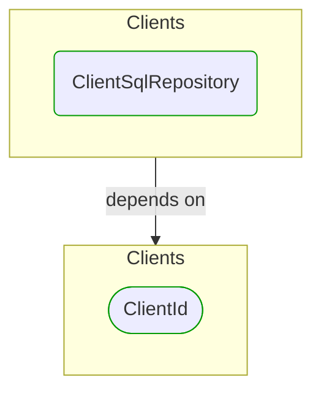


# [*Domain building block*] ClientSqlRepository

This view contains details information about ClientSqlRepository building block, including:
- dependencies
- modules
- related processes  

---

## Domain Perspective

### Dependencies

### Related process steps

ClientSqlRepository is not used in any process step.  

## Next steps

### Zoom-out

- [[*Domain module*] Clients](../../../Modules/Sales/Clients/Clients.md)

### Change perspective

- [[*Domain building block*] ClientId](ClientId.md)

---

[P3 Model](https://github.com/P3-model/P3-model) documentation generated from source code using [.net tooling](https://github.com/P3-model/P3-model-dotnet)