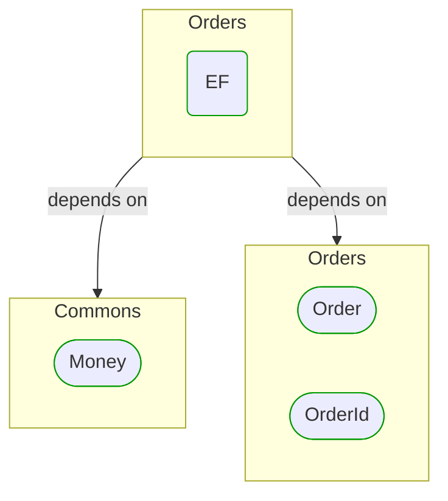

# [*Domain building block*] EF

This view contains details information about EF building block, including:
- dependencies
- modules
- related processes  

---

## Domain Perspective

### Dependencies

### Related process steps

EF is not used in any process step.  

## Next steps

### Zoom-out

- [[*Domain module*] Orders](../../../Modules/Sales/Orders/Orders.md)

### Change perspective

- [[*Domain building block*] OrderId](OrderId.md)
- [[*Domain building block*] Money](../Commons/Money.md)
- [[*Domain building block*] Order](Order.md)

---

[P3 Model](https://github.com/P3-model/P3-model) documentation generated from source code using [.net tooling](https://github.com/P3-model/P3-model-dotnet)