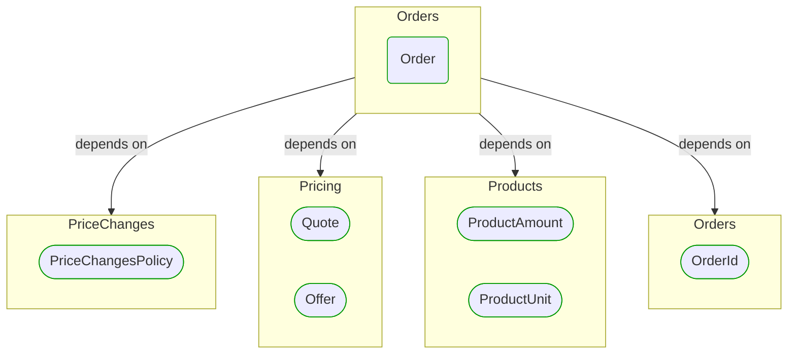
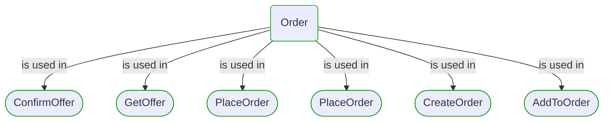


# [*Domain building block*] Order

This view contains details information about Order building block, including:
- dependencies
- modules
- related processes  

---

## Domain Perspective

### Dependencies

### Related process steps

## Next steps

### Zoom-out

- [[*Domain module*] Orders](../../../Modules/Sales/Orders/Orders.md)

### Change perspective

- [[*Domain building block*] ProductUnit](../Products/ProductUnit.md)
- [[*Domain building block*] Quote](../Pricing/Quote.md)
- [[*Domain building block*] OrderId](OrderId.md)
- [[*Domain building block*] Offer](../Pricing/Offer.md)
- [[*Domain building block*] ProductAmount](../Products/ProductAmount.md)
- [[*Domain building block*] PriceChangesPolicy](PriceChanges/PriceChangesPolicy.md)

---

[P3 Model](https://github.com/P3-model/P3-model) documentation generated from source code using [.net tooling](https://github.com/P3-model/P3-model-dotnet)