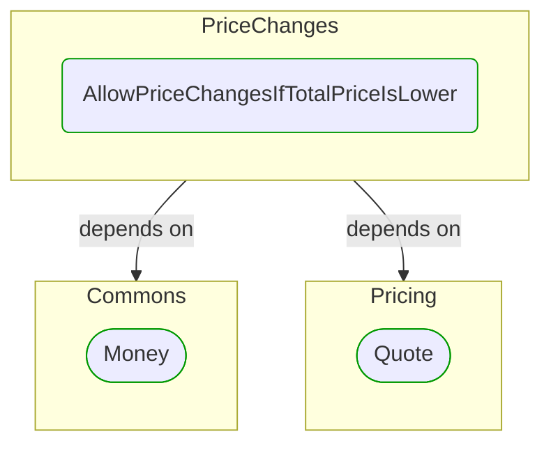


# [*Domain building block*] AllowPriceChangesIfTotalPriceIsLower

This view contains details information about AllowPriceChangesIfTotalPriceIsLower building block, including:
- dependencies
- modules
- related processes  

---

## Domain Perspective

### Dependencies

### Related process steps

AllowPriceChangesIfTotalPriceIsLower is not used in any process step.  

## Next steps

### Zoom-out

- [[*Domain module*] PriceChanges](../../../../Modules/Sales/Orders/PriceChanges/PriceChanges.md)

### Change perspective

- [[*Domain building block*] Money](../../Commons/Money.md)
- [[*Domain building block*] Quote](../../Pricing/Quote.md)

---

[P3 Model](https://github.com/P3-model/P3-model) documentation generated from source code using [.net tooling](https://github.com/P3-model/P3-model-dotnet)