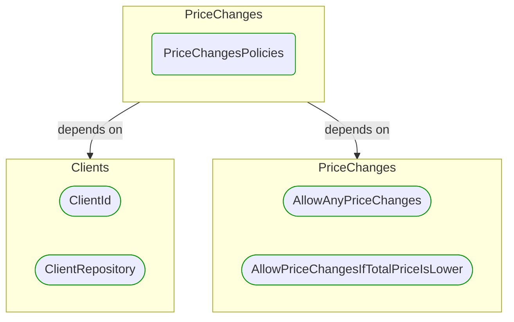
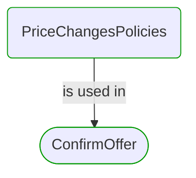


# [*Domain building block*] PriceChangesPolicies

This view contains details information about PriceChangesPolicies building block, including:
- dependencies
- modules
- related processes  

---

## Domain Perspective

### Dependencies

### Related process steps

## Next steps

### Zoom-out

- [[*Domain module*] PriceChanges](../../../../Modules/Sales/Orders/PriceChanges/PriceChanges.md)

### Change perspective

- [[*Domain building block*] ClientRepository](../../Clients/ClientRepository.md)
- [[*Domain building block*] AllowAnyPriceChanges](AllowAnyPriceChanges.md)
- [[*Domain building block*] ClientId](../../Clients/ClientId.md)
- [[*Domain building block*] AllowPriceChangesIfTotalPriceIsLower](AllowPriceChangesIfTotalPriceIsLower.md)

---

[P3 Model](https://github.com/P3-model/P3-model) documentation generated from source code using [.net tooling](https://github.com/P3-model/P3-model-dotnet)