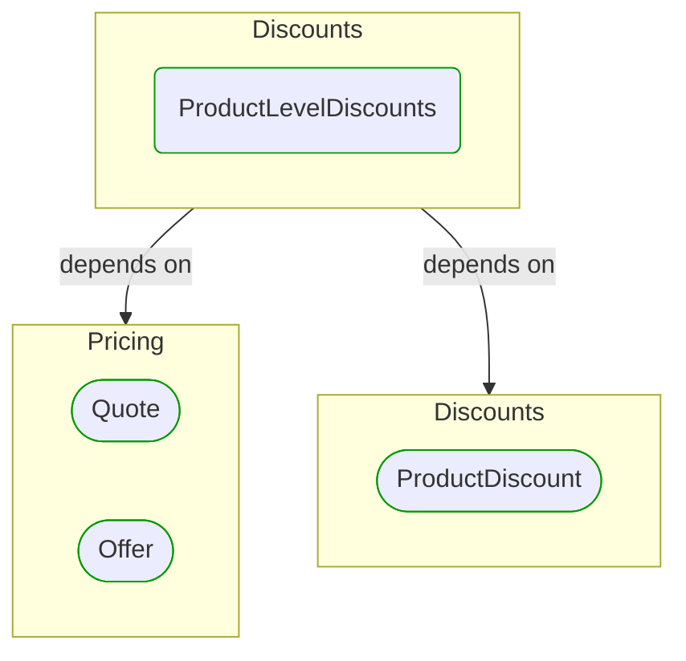


# [*Domain building block*] ProductLevelDiscounts

This view contains details information about ProductLevelDiscounts building block, including:
- dependencies
- modules
- related processes  

---

## Domain Perspective

### Dependencies

### Related process steps

ProductLevelDiscounts is not used in any process step.  

## Next steps

### Zoom-out

- [[*Domain module*] Discounts](../../../../Modules/Sales/Pricing/Discounts/Discounts.md)

### Change perspective

- [[*Domain building block*] Quote](../Quote.md)
- [[*Domain building block*] ProductDiscount](ProductDiscount.md)
- [[*Domain building block*] Offer](../Offer.md)

---

[P3 Model](https://github.com/P3-model/P3-model) documentation generated from source code using [.net tooling](https://github.com/P3-model/P3-model-dotnet)