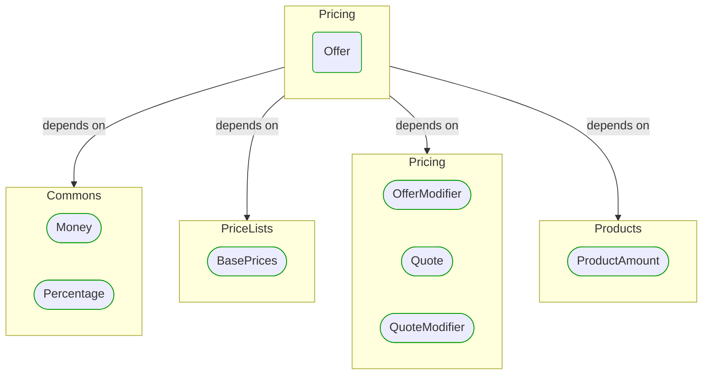
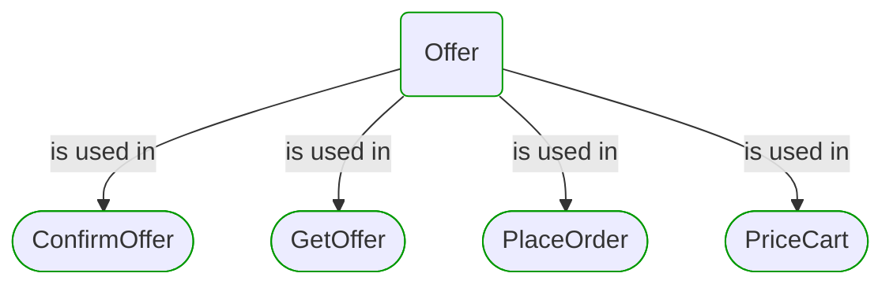


# [*Domain building block*] Offer

This view contains details information about Offer building block, including:
- dependencies
- modules
- related processes  

---

## Domain Perspective

### Dependencies

### Related process steps

## Next steps

### Zoom-out

- [[*Domain module*] Pricing](../../../Modules/Sales/Pricing/Pricing.md)

### Change perspective

- [[*Domain building block*] QuoteModifier](QuoteModifier.md)
- [[*Domain building block*] BasePrices](PriceLists/BasePrices.md)
- [[*Domain building block*] OfferModifier](OfferModifier.md)
- [[*Domain building block*] ProductAmount](../Products/ProductAmount.md)
- [[*Domain building block*] Money](../Commons/Money.md)
- [[*Domain building block*] Quote](Quote.md)
- [[*Domain building block*] Percentage](../Commons/Percentage.md)

---

[P3 Model](https://github.com/P3-model/P3-model) documentation generated from source code using [.net tooling](https://github.com/P3-model/P3-model-dotnet)