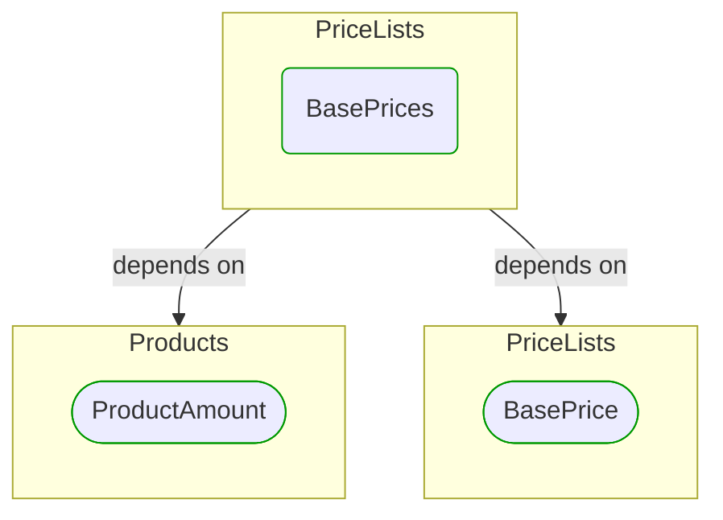

# [*Domain building block*] BasePrices

This view contains details information about BasePrices building block, including:
- dependencies
- modules
- related processes  

---

## Domain Perspective

### Dependencies

### Related process steps

BasePrices is not used in any process step.  

## Next steps

### Zoom-out

- [[*Domain module*] PriceLists](../../../../Modules/Sales/Pricing/PriceLists/PriceLists.md)

### Change perspective

- [[*Domain building block*] ProductAmount](../../Products/ProductAmount.md)
- [[*Domain building block*] BasePrice](BasePrice.md)

---

[P3 Model](https://github.com/P3-model/P3-model) documentation generated from source code using [.net tooling](https://github.com/P3-model/P3-model-dotnet)