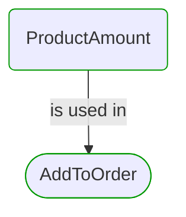

# [*Domain building block*] ProductAmount

This view contains details information about ProductAmount building block, including:
- dependencies
- modules
- related processes  

---

## Domain Perspective

### Dependencies

### Related process steps

## Next steps

### Zoom-out

- [[*Domain module*] Products](../../../Modules/Sales/Products/Products.md)

### Change perspective

- [[*Domain building block*] ProductId](ProductId.md)
- [[*Domain building block*] ProductUnit](ProductUnit.md)
- [[*Domain building block*] Amount](Amount.md)

---

[P3 Model](https://github.com/P3-model/P3-model) documentation generated from source code using [.net tooling](https://github.com/P3-model/P3-model-dotnet)