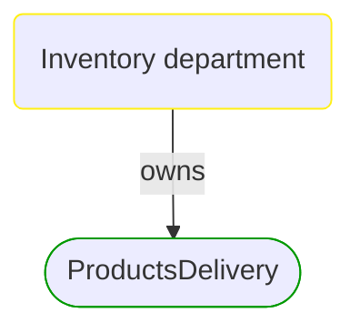

# [*Business organizational unit*] Inventory department

This view contains details information about Inventory department, including:
- related domain modules  

---

## Domain Perspective

### Related domain modules

## Next steps

### Zoom-out

- [Business organizational units](../Business_Organizational_Units.md)

---

[P3 Model](https://github.com/P3-model/P3-model) documentation generated from source code using [.net tooling](https://github.com/P3-model/P3-model-dotnet)