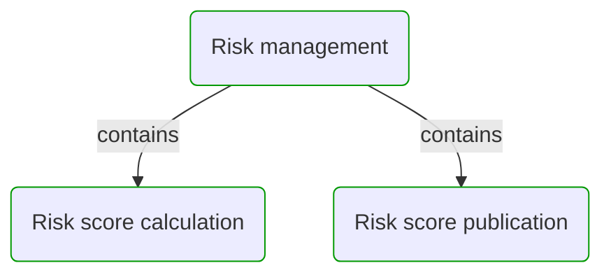
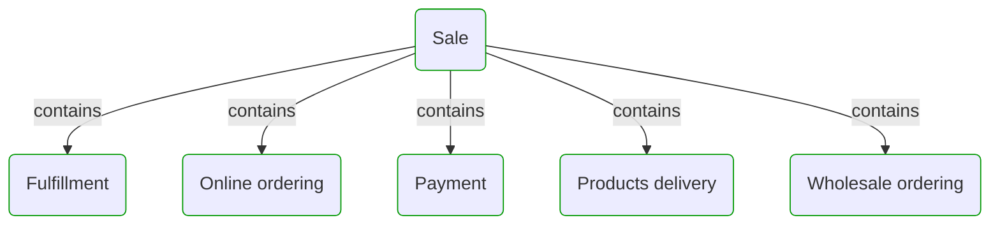

# Business processes

This view contains all business processes with their sub-processes.  

---

## Risk management

## Sale

## Next steps

### Zoom-in

#### Domain perspective

##### Processes

[Fulfillment](Processes/Sale/Fulfillment/Fulfillment.md)  
[Online ordering](Processes/Sale/Online ordering/Online ordering.md)  
[Payment](Processes/Sale/Payment/Payment.md)  
[Products delivery](Processes/Sale/Products delivery/Products delivery.md)  
[Risk management](Processes/Risk management/Risk management.md)  
[Risk score calculation](Processes/Risk management/Risk score calculation/Risk score calculation.md)  
[Risk score publication](Processes/Risk management/Risk score publication/Risk score publication.md)  
[Sale](Processes/Sale/Sale.md)  
[Wholesale ordering](Processes/Sale/Wholesale ordering/Wholesale ordering.md)  

### Zoom-out

#### Multi perspectives

##### Cross elements

[Main page](README.md)  

---

[P3 Model](https://github.com/P3-model/P3-model) documentation generated from source code using [.net tooling](https://github.com/P3-model/P3-model-dotnet)