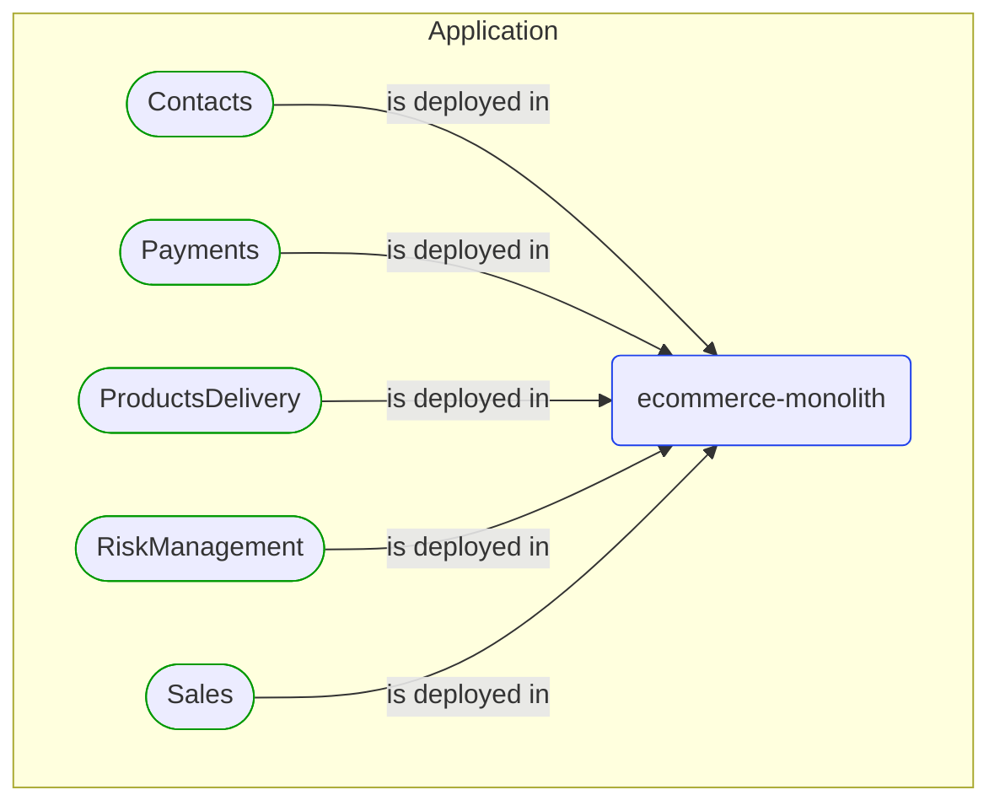
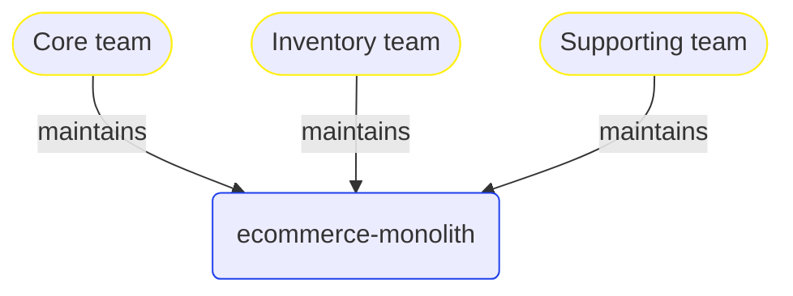


# [*Deployable unit*] ecommerce-monolith

This view contains details information about ecommerce-monolith deployable unit, including:
- related domain modules
- related development teams  

---

## Domain Perspective

### Related domain modules

## People Perspective

### Related development teams

## Next steps

### Zoom-out

- [Deployable units](../Deployable_Units.md)

---

[P3 Model](https://github.com/P3-model/P3-model) documentation generated from source code using [.net tooling](https://github.com/P3-model/P3-model-dotnet)