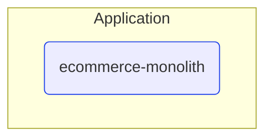


# Deployable units

This view contains all deployable units for MyCompany e-commerce product.  

---

## Deployable units and their tires

## Next steps

### Zoom-in

- [[*Deployable unit*] ecommerce-monolith](DeployableUnits/ecommerce-monolith.md)

### Zoom-out

- [Main page](README.md)

---

[P3 Model](https://github.com/P3-model/P3-model) documentation generated from source code using [.net tooling](https://github.com/P3-model/P3-model-dotnet)