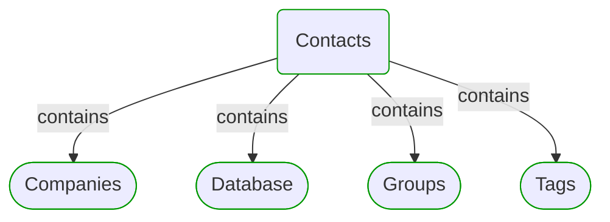

# Contacts

***Domain Module***  

This view contains details information about Contacts domain module, including:
- other related modules
- related processes
- related building blocks
- related deployable units
- engaged people: actors, development teams, business stakeholders  

---

## Domain Perspective

### Related modules

### Related processes

No related processes were found.  

### Direct building blocks

No direct building blocks were found.  

## Technology Perspective

### Related deployable units

No related deployable units were found.  

## People Perspective

### Engaged people

No engaged people were found.  

## Next steps

### Zoom-in

#### Domain perspective

##### Domain Modules

[Companies](Companies/Companies.md)  
[Database](Database/Database.md)  
[Groups](Groups/Groups.md)  
[Tags](Tags/Tags.md)  

### Zoom-out

#### Domain perspective

[Domain Modules](../DomainModules.md)  

---

[P3 Model](https://github.com/P3-model/P3-model) documentation generated from source code using [.net tooling](https://github.com/P3-model/P3-model-dotnet)