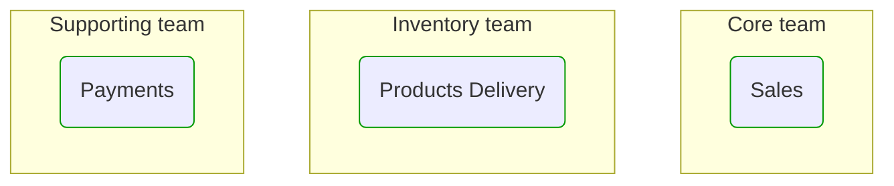
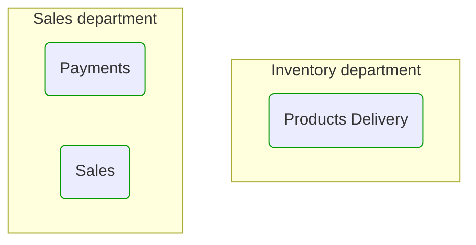
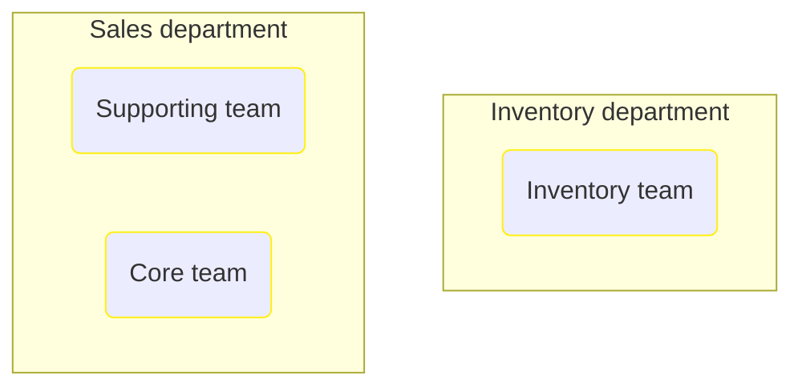


# Domain Module Owners

This view shows how first level domain modules are assigned to development teams and business organizational units.  

---

## Development Teams and Domain Modules they maintain

## Business Organizational Units and Domain Modules they own

## Business Organizational Units and related Development Teams

## Next steps

### Zoom-in

#### Domain perspective

##### Domain Modules

[Contacts](Contacts/Contacts.md)  
[Payments](Payments/Payments.md)  
[Products delivery](ProductsDelivery/ProductsDelivery.md)  
[Risk management](RiskManagement/RiskManagement.md)  
[Sales](Sales/Sales.md)  

#### People perspective

##### Business Organizational Units

[Inventory department](../../People/BusinessOrganizationalUnits/InventoryDepartment.md)  
[Sales department](../../People/BusinessOrganizationalUnits/SalesDepartment.md)  

##### Development Teams

[Core team](../../People/DevelopmentTeams/CoreTeam.md)  
[Inventory team](../../People/DevelopmentTeams/InventoryTeam.md)  
[Supporting team](../../People/DevelopmentTeams/SupportingTeam.md)  

### Zoom-out

#### Multi perspectives

[Main page](../../README.md)  

#### Domain perspective

[Domain Modules](DomainModules.md)  

#### People perspective

[Business Organizational Units](../../People/BusinessOrganizationalUnits/BusinessOrganizationalUnits.md)  
[Development Teams](../../People/DevelopmentTeams/DevelopmentTeams.md)  

---

[P3 Model](https://github.com/P3-model/P3-model) documentation generated from source code using [.net tooling](https://github.com/P3-model/P3-model-dotnet)