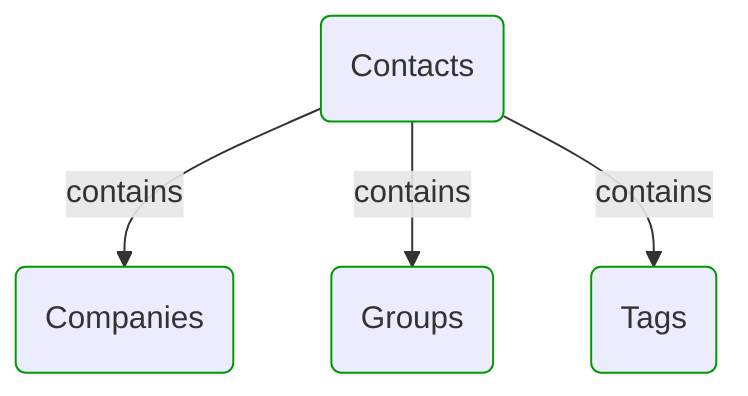
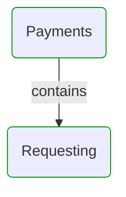
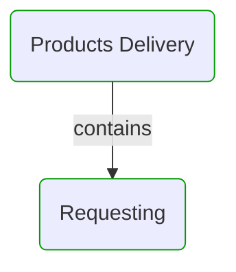
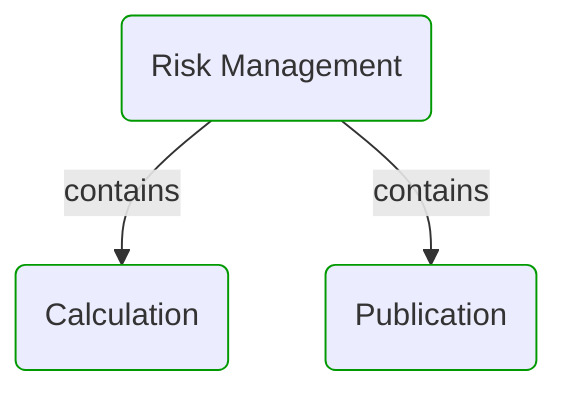


# Domain Modules

This view shows domain model modularization.  
First level modules can be treated as separate sub-models or DDD Bounded Contexts.  
All modules can be divided into sub-modules to reflect hierarchical structure of the domain.  

---

## Modules hierarchy

## Contacts

## Payments

## Products Delivery

## Risk Management

## Sales

```mermaid
  flowchart TB
    0(Sales)
    class 0 DomainPerspective
    1(Clients)
    class 1 DomainPerspective
    0-->|contains|1
    2(Commons)
    class 2 DomainPerspective
    0-->|contains|2
    3(Exchange Rates)
    class 3 DomainPerspective
    0-->|contains|3
    4(Fulfillment)
    class 4 DomainPerspective
    0-->|contains|4
    5(Online Ordering)
    class 5 DomainPerspective
    0-->|contains|5
    6(Cart Pricing)
    class 6 DomainPerspective
    5-->|contains|6
    7(Order Placement)
    class 7 DomainPerspective
    5-->|contains|7
    8(Orders)
    class 8 DomainPerspective
    0-->|contains|8
    9(Price Changes)
    class 9 DomainPerspective
    8-->|contains|9
    10(Pricing)
    class 10 DomainPerspective
    0-->|contains|10
    11(Discounts)
    class 11 DomainPerspective
    10-->|contains|11
    12(Price Lists)
    class 12 DomainPerspective
    10-->|contains|12
    13(Special Offers)
    class 13 DomainPerspective
    10-->|contains|13
    14(Products)
    class 14 DomainPerspective
    0-->|contains|14
    15(Sales Channels)
    class 15 DomainPerspective
    0-->|contains|15
    16(Time)
    class 16 DomainPerspective
    0-->|contains|16
    17(Wholesale Ordering)
    class 17 DomainPerspective
    0-->|contains|17
    18(Order Creation)
    class 18 DomainPerspective
    17-->|contains|18
    19(Order Modification)
    class 19 DomainPerspective
    17-->|contains|19
    20(Order Placement)
    class 20 DomainPerspective
    17-->|contains|20
    21(Order Pricing)
    class 21 DomainPerspective
    17-->|contains|21
    22(Product Pricing)
    class 22 DomainPerspective
    17-->|contains|22
    classDef DomainPerspective stroke:#009900
    classDef TechnologyPerspective stroke:#1F41EB
    classDef PeoplePerspective stroke:#FFF014
```

## Next steps

### Zoom-in

#### Domain perspective

[Domain Module Owners](DomainModuleOwners.md)  

##### Domain Modules

[Contacts](Contacts/Contacts.md)  
[Contacts | Companies](Contacts/Companies/Companies.md)  
[Contacts | Groups](Contacts/Groups/Groups.md)  
[Contacts | Tags](Contacts/Tags/Tags.md)  
[Payments](Payments/Payments.md)  
[Payments | Requesting](Payments/Requesting/Requesting.md)  
[Products delivery](ProductsDelivery/ProductsDelivery.md)  
[Products delivery | Requesting](ProductsDelivery/Requesting/Requesting.md)  
[Risk management](RiskManagement/RiskManagement.md)  
[Risk management | Calculation](RiskManagement/Calculation/Calculation.md)  
[Risk management | Publication](RiskManagement/Publication/Publication.md)  
[Sales](Sales/Sales.md)  
[Sales | Clients](Sales/Clients/Clients.md)  
[Sales | Commons](Sales/Commons/Commons.md)  
[Sales | Exchange rates](Sales/ExchangeRates/ExchangeRates.md)  
[Sales | Fulfillment](Sales/Fulfillment/Fulfillment.md)  
[Sales | Integrations | Payments](Sales/Integrations/Payments/Payments.md)  
[Sales | Integrations | Products delivery](Sales/Integrations/ProductsDelivery/ProductsDelivery.md)  
[Sales | Integrations | Risk management](Sales/Integrations/RiskManagement/RiskManagement.md)  
[Sales | Online ordering](Sales/OnlineOrdering/OnlineOrdering.md)  
[Sales | Online ordering | Cart pricing](Sales/OnlineOrdering/CartPricing/CartPricing.md)  
[Sales | Online ordering | Order placement](Sales/OnlineOrdering/OrderPlacement/OrderPlacement.md)  
[Sales | Orders](Sales/Orders/Orders.md)  
[Sales | Orders | Price changes](Sales/Orders/PriceChanges/PriceChanges.md)  
[Sales | Pricing](Sales/Pricing/Pricing.md)  
[Sales | Pricing | Discounts](Sales/Pricing/Discounts/Discounts.md)  
[Sales | Pricing | Price lists](Sales/Pricing/PriceLists/PriceLists.md)  
[Sales | Pricing | Special offers](Sales/Pricing/SpecialOffers/SpecialOffers.md)  
[Sales | Products](Sales/Products/Products.md)  
[Sales | Sales channels](Sales/SalesChannels/SalesChannels.md)  
[Sales | Time](Sales/Time/Time.md)  
[Sales | Wholesale ordering](Sales/WholesaleOrdering/WholesaleOrdering.md)  
[Sales | Wholesale ordering | Order creation](Sales/WholesaleOrdering/OrderCreation/OrderCreation.md)  
[Sales | Wholesale ordering | Order modification](Sales/WholesaleOrdering/OrderModification/OrderModification.md)  
[Sales | Wholesale ordering | Order placement](Sales/WholesaleOrdering/OrderPlacement/OrderPlacement.md)  
[Sales | Wholesale ordering | Order pricing](Sales/WholesaleOrdering/OrderPricing/OrderPricing.md)  
[Sales | Wholesale ordering | Product pricing](Sales/WholesaleOrdering/ProductPricing/ProductPricing.md)  

### Zoom-out

#### Multi perspectives

[Main page](../../README.md)  

---

[P3 Model](https://github.com/P3-model/P3-model) documentation generated from source code using [.net tooling](https://github.com/P3-model/P3-model-dotnet)