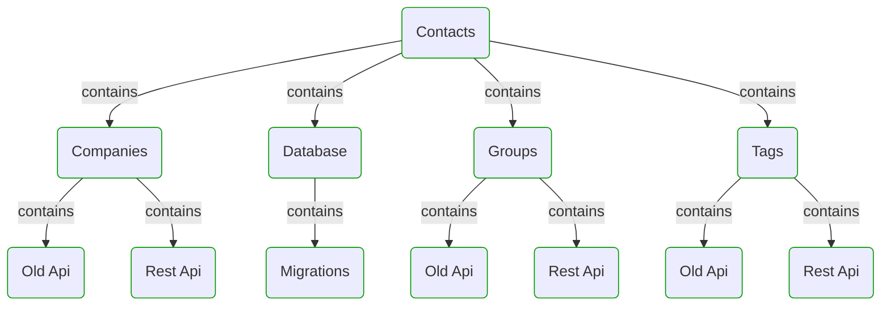
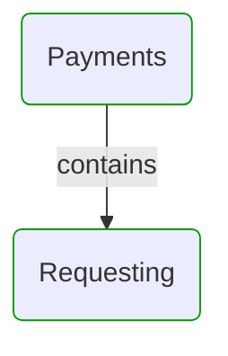
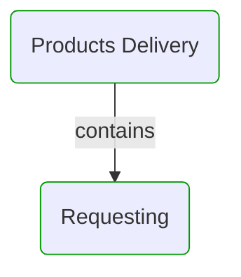
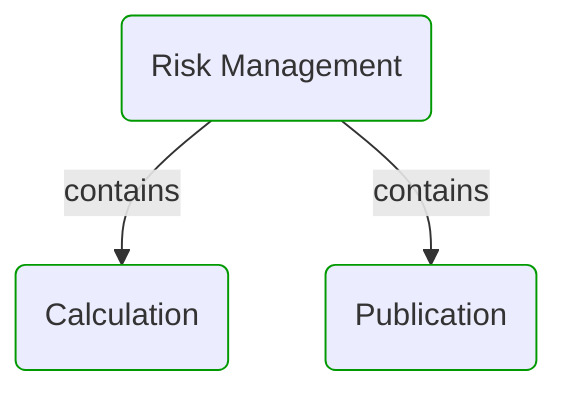


# Domain Modules

This view shows domain model modularization.  
First level modules can be treated as separate sub-models or DDD Bounded Contexts.  
All modules can be divided into sub-modules to reflect hierarchical structure of the domain.  

---

## Modules hierarchy

## Contacts

## Payments

## Products Delivery

## Risk Management

## Sales

```mermaid
  flowchart TB
    0(Sales)
    class 0 DomainPerspective
    1(Clients)
    class 1 DomainPerspective
    0-->|contains|1
    2(Commons)
    class 2 DomainPerspective
    0-->|contains|2
    3(Exchange Rates)
    class 3 DomainPerspective
    0-->|contains|3
    4(Fulfillment)
    class 4 DomainPerspective
    0-->|contains|4
    5(Online Ordering)
    class 5 DomainPerspective
    0-->|contains|5
    6(Cart Pricing)
    class 6 DomainPerspective
    5-->|contains|6
    7(Order Placement)
    class 7 DomainPerspective
    5-->|contains|7
    8(Orders)
    class 8 DomainPerspective
    0-->|contains|8
    9(Price Changes)
    class 9 DomainPerspective
    8-->|contains|9
    10(Pricing)
    class 10 DomainPerspective
    0-->|contains|10
    11(Discounts)
    class 11 DomainPerspective
    10-->|contains|11
    12(Price Lists)
    class 12 DomainPerspective
    10-->|contains|12
    13(Special Offers)
    class 13 DomainPerspective
    10-->|contains|13
    14(Products)
    class 14 DomainPerspective
    0-->|contains|14
    15(Sales Channels)
    class 15 DomainPerspective
    0-->|contains|15
    16(Time)
    class 16 DomainPerspective
    0-->|contains|16
    17(Wholesale Ordering)
    class 17 DomainPerspective
    0-->|contains|17
    18(Order Creation)
    class 18 DomainPerspective
    17-->|contains|18
    19(Order Modification)
    class 19 DomainPerspective
    17-->|contains|19
    20(Order Placement)
    class 20 DomainPerspective
    17-->|contains|20
    21(Order Pricing)
    class 21 DomainPerspective
    17-->|contains|21
    22(Product Pricing)
    class 22 DomainPerspective
    17-->|contains|22
    classDef DomainPerspective stroke:#009900
    classDef TechnologyPerspective stroke:#1F41EB
    classDef PeoplePerspective stroke:#FFF014
```

## Next steps

### Zoom-in

#### Domain perspective

##### Domain Modules

[Calculation](RiskManagement/Calculation/Calculation.md)  
[Cart Pricing](Sales/OnlineOrdering/CartPricing/CartPricing.md)  
[Clients](Sales/Clients/Clients.md)  
[Commons](Sales/Commons/Commons.md)  
[Companies](Contacts/Companies/Companies.md)  
[Contacts](Contacts/Contacts.md)  
[Database](Contacts/Database/Database.md)  
[Discounts](Sales/Pricing/Discounts/Discounts.md)  
[Exchange Rates](Sales/ExchangeRates/ExchangeRates.md)  
[Fulfillment](Sales/Fulfillment/Fulfillment.md)  
[Groups](Contacts/Groups/Groups.md)  
[Migrations](Contacts/Database/Migrations/Migrations.md)  
[Old Api](Contacts/Groups/OldApi/OldApi.md)  
[Old Api](Contacts/Companies/OldApi/OldApi.md)  
[Old Api](Contacts/Tags/OldApi/OldApi.md)  
[Online Ordering](Sales/OnlineOrdering/OnlineOrdering.md)  
[Order Creation](Sales/WholesaleOrdering/OrderCreation/OrderCreation.md)  
[Order Modification](Sales/WholesaleOrdering/OrderModification/OrderModification.md)  
[Order Placement](Sales/WholesaleOrdering/OrderPlacement/OrderPlacement.md)  
[Order Placement](Sales/OnlineOrdering/OrderPlacement/OrderPlacement.md)  
[Order Pricing](Sales/WholesaleOrdering/OrderPricing/OrderPricing.md)  
[Orders](Sales/Orders/Orders.md)  
[Payments](Payments/Payments.md)  
[Payments](Sales/Integrations/Payments/Payments.md)  
[Price Changes](Sales/Orders/PriceChanges/PriceChanges.md)  
[Price Lists](Sales/Pricing/PriceLists/PriceLists.md)  
[Pricing](Sales/Pricing/Pricing.md)  
[Product Pricing](Sales/WholesaleOrdering/ProductPricing/ProductPricing.md)  
[Products](Sales/Products/Products.md)  
[Products Delivery](Sales/Integrations/ProductsDelivery/ProductsDelivery.md)  
[Products Delivery](Products Delivery/ProductsDelivery.md)  
[Products Delivery](ProductsDelivery/ProductsDelivery.md)  
[Publication](RiskManagement/Publication/Publication.md)  
[Requesting](ProductsDelivery/Requesting/Requesting.md)  
[Requesting](Payments/Requesting/Requesting.md)  
[Rest Api](Contacts/Tags/RestApi/RestApi.md)  
[Rest Api](Contacts/Groups/RestApi/RestApi.md)  
[Rest Api](Contacts/Companies/RestApi/RestApi.md)  
[Risk Management](Sales/Integrations/RiskManagement/RiskManagement.md)  
[Risk Management](RiskManagement/RiskManagement.md)  
[Sales](Sales/Sales.md)  
[Sales Channels](Sales/SalesChannels/SalesChannels.md)  
[Special Offers](Sales/Pricing/SpecialOffers/SpecialOffers.md)  
[Tags](Contacts/Tags/Tags.md)  
[Time](Sales/Time/Time.md)  
[Wholesale Ordering](Sales/WholesaleOrdering/WholesaleOrdering.md)  

### Zoom-out

#### Multi perspectives

[Main page](../../README.md)  

---

[P3 Model](https://github.com/P3-model/P3-model) documentation generated from source code using [.net tooling](https://github.com/P3-model/P3-model-dotnet)