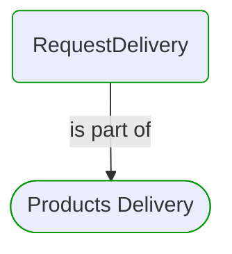


# RequestDelivery

***Process Step***  

This view contains details information about RequestDelivery business processes step, including:
- related process
- next process steps
- related domain module
- related deployable unit
- engaged people: actors, development teams, business stakeholders  

---

## Domain Perspective

### Process

### Used Building Blocks

No building blocks were found. Maybe this process step is not implemented yet?  

## Technology Perspective

No related deployable unit was found.  

## People Perspective

No engaged people were found.  

## Next steps

### Zoom-out

#### Domain perspective

##### Domain Modules

[Requesting](Requesting.md)  

##### Processes

[Products Delivery](../../../Processes/Sale/Products delivery/ProductsDelivery.md)  

---

[P3 Model](https://github.com/P3-model/P3-model) documentation generated from source code using [.net tooling](https://github.com/P3-model/P3-model-dotnet)