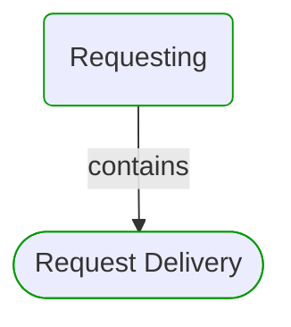
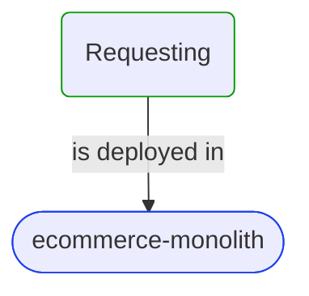
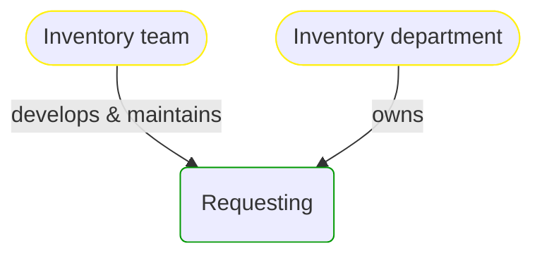


# Requesting

***Domain Module***  

This view contains details information about Requesting domain module, including:
- other related modules
- related processes
- related building blocks
- related deployable units
- engaged people: actors, development teams, business stakeholders  

---

## Domain Perspective

### Related modules

### Related processes

### Direct building blocks

## Technology Perspective

### Related deployable units

## People Perspective

### Engaged people

## Next steps

### Zoom-in

#### Domain perspective

##### Processes

[Products Delivery](../../../Processes/Sale/Products delivery/ProductsDelivery.md)  

##### Process Steps

[Request Delivery](RequestDelivery.md)  

#### Technology perspective

##### Deployable Units

[ecommerce-monolith](../../../../Technology/DeployableUnits/EcommerceMonolith.md)  

#### People perspective

##### Business Organizational Units

[Inventory department](../../../../People/BusinessOrganizationalUnits/InventoryDepartment.md)  

##### Development Teams

[Inventory team](../../../../People/DevelopmentTeams/InventoryTeam.md)  

### Zoom-out

#### Domain perspective

##### Domain Modules

[Products delivery](../ProductsDelivery.md)  

---

[P3 Model](https://github.com/P3-model/P3-model) documentation generated from source code using [.net tooling](https://github.com/P3-model/P3-model-dotnet)