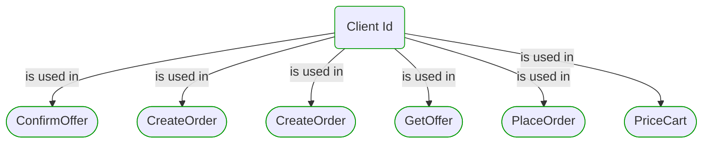


# Client Id

***Ddd Value Object***  

This view contains details information about Client Id building block, including:
- dependencies
- modules
- related processes  

---

## Domain Perspective

### Dependencies

```mermaid
  flowchart TB
    subgraph 0["Sales / Online Ordering / Cart Pricing"]
      1([PriceCart])
      class 1 DomainPerspective
    end
    subgraph 2["Sales / Clients"]
      3([Client Repository])
      class 3 DomainPerspective
    end
    subgraph 4["Sales / Pricing / Discounts"]
      5([Discounts Repository])
      class 5 DomainPerspective
    end
    subgraph 6["Sales / Wholesale Ordering / Order Creation"]
      7([CreateOrder])
      class 7 DomainPerspective
    end
    subgraph 8["Sales / Online Ordering / Order Placement"]
      9([PlaceOrder])
      class 9 DomainPerspective
    end
    subgraph 10["Sales / Wholesale Ordering / Order Pricing"]
      11([ConfirmOffer])
      class 11 DomainPerspective
      12([GetOffer])
      class 12 DomainPerspective
    end
    subgraph 13["Sales / Orders"]
      14([Order Factory])
      class 14 DomainPerspective
    end
    subgraph 15["Sales / Orders / Price Changes"]
      16([Price Changes Policies])
      class 16 DomainPerspective
    end
    subgraph 17["Sales / Pricing / Price Lists"]
      18([Price List Repository])
      class 18 DomainPerspective
    end
    subgraph 19["Sales / Pricing"]
      20([Calculate Prices])
      class 20 DomainPerspective
      21([Offer Request])
      class 21 DomainPerspective
    end
    subgraph 22["Sales / Wholesale Ordering / Product Pricing"]
      23([CreateOrder])
      class 23 DomainPerspective
    end
    subgraph 24["Sales / Clients"]
      25(Client Id)
      class 25 DomainPerspective
    end
    0-->|depends on|24
    2-->|depends on|24
    4-->|depends on|24
    6-->|depends on|24
    8-->|depends on|24
    10-->|depends on|24
    13-->|depends on|24
    15-->|depends on|24
    17-->|depends on|24
    19-->|depends on|24
    22-->|depends on|24
    classDef DomainPerspective stroke:#009900
    classDef TechnologyPerspective stroke:#1F41EB
    classDef PeoplePerspective stroke:#FFF014
```

### Related process steps

## Next steps

### Zoom-in

#### Domain perspective

##### Process Steps

[ConfirmOffer](../WholesaleOrdering/OrderPricing/ConfirmOffer.md)  
[CreateOrder](../WholesaleOrdering/OrderCreation/CreateOrder.md)  
[CreateOrder](../WholesaleOrdering/ProductPricing/CreateOrder.md)  
[GetOffer](../WholesaleOrdering/OrderPricing/GetOffer.md)  
[PlaceOrder](../OnlineOrdering/OrderPlacement/PlaceOrder.md)  
[PriceCart](../OnlineOrdering/CartPricing/PriceCart.md)  

### Zoom-out

#### Domain perspective

##### Domain Modules

[Clients](Clients.md)  

---

[P3 Model](https://github.com/P3-model/P3-model) documentation generated from source code using [.net tooling](https://github.com/P3-model/P3-model-dotnet)