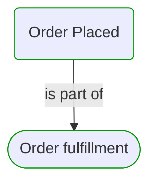
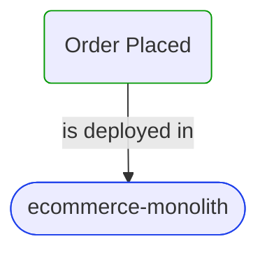
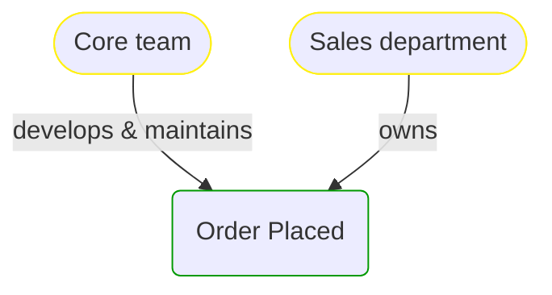


# Order Placed

***Process Step***  

This view contains details information about Order Placed business processes step, including:
- related process
- next process steps
- related domain module
- related deployable unit
- engaged people: actors, development teams, business stakeholders  

---

## Domain Perspective

### Process

### Used Building Blocks

No building blocks were found. Maybe this process step is not implemented yet?  

## Technology Perspective

### Source code

[OrderPlacedHandler.cs](../../../../../../../Sources/Sales/Sales.ProcessModel/Fulfillment/OrderPlacedHandler.cs)  

## People Perspective

## Next steps

### Zoom-in

#### Technology perspective

##### Deployable Units

[ecommerce-monolith](../../../../Technology/DeployableUnits/EcommerceMonolith.md)  

#### People perspective

##### Business Organizational Units

[Sales department](../../../../People/BusinessOrganizationalUnits/SalesDepartment.md)  

##### Development Teams

[Core team](../../../../People/DevelopmentTeams/CoreTeam.md)  

### Zoom-out

#### Domain perspective

##### Domain Modules

[Sales | Fulfillment](Fulfillment.md)  

##### Processes

[Order fulfillment](../../../Processes/OrderFulfillment.md)  

---

[P3 Model](https://github.com/P3-model/P3-model) documentation generated from source code using [.net tooling](https://github.com/P3-model/P3-model-dotnet)