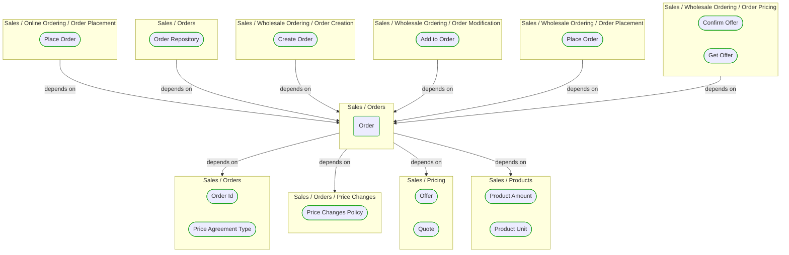
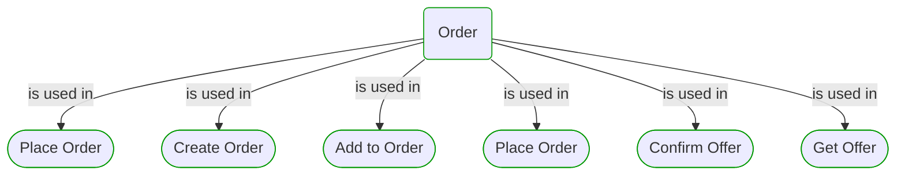

# Order

***Ddd Aggregate***  

This view contains details information about Order building block, including:
- dependencies
- modules
- related processes  

---

## Domain Perspective

### Dependencies

### Related process steps

## Next steps

### Zoom-in

#### Domain perspective

##### Ddd Domain Services

[Price Changes Policy](PriceChanges/PriceChangesPolicy.md)  

##### Ddd Value Objects

[Offer](../Pricing/Offer.md)  
[Order Id](OrderId.md)  
[Price Agreement Type](PriceAgreementType.md)  
[Product Amount](../Products/ProductAmount.md)  
[Product Unit](../Products/ProductUnit.md)  
[Quote](../Pricing/Quote.md)  

##### Process Steps

[Add to Order](../WholesaleOrdering/OrderModification/AddToOrder.md)  
[Confirm Offer](../WholesaleOrdering/OrderPricing/ConfirmOffer.md)  
[Create Order](../WholesaleOrdering/OrderCreation/CreateOrder.md)  
[Get Offer](../WholesaleOrdering/OrderPricing/GetOffer.md)  
[Place Order](../WholesaleOrdering/OrderPlacement/PlaceOrder.md)  
[Place Order](../OnlineOrdering/OrderPlacement/PlaceOrder.md)  

### Zoom-out

#### Domain perspective

##### Domain Modules

[Orders](Orders.md)  

---

[P3 Model](https://github.com/P3-model/P3-model) documentation generated from source code using [.net tooling](https://github.com/P3-model/P3-model-dotnet)