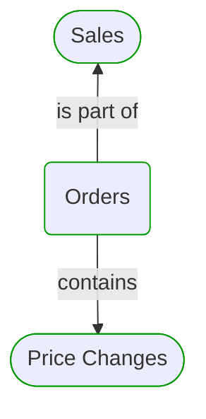
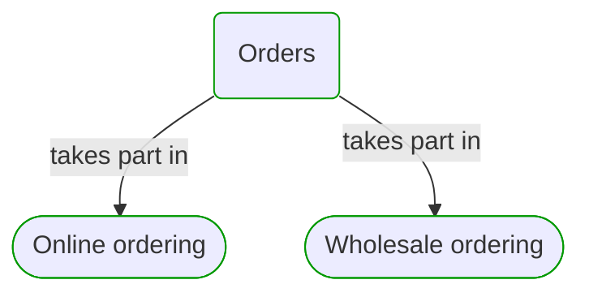
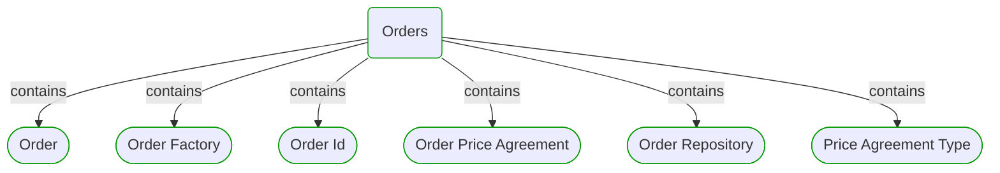
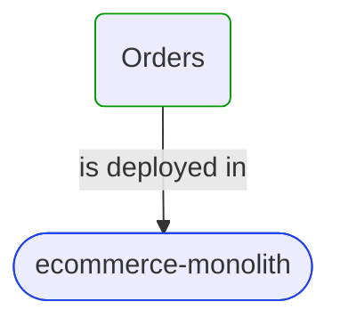
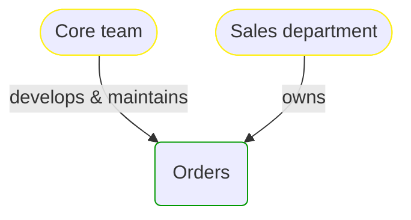


# Orders

***Domain Module***  

This view contains details information about Orders domain module, including:
- other related modules
- related processes
- related building blocks
- related deployable units
- engaged people: actors, development teams, business stakeholders  

---

## Domain Perspective

### Related modules

### Related processes

### Direct building blocks

## Technology Perspective

### Related deployable units

### Source code

- [Orders](../../../../../../../Sources/Sales/Sales.DeepModel/Orders)
- [Orders](../../../../../../../Sources/Sales/Sales.IntegrationTests/Orders)
- [Orders](../../../../../../../Sources/Sales/Sales.Adapters/Orders)

## People Perspective

### Engaged people

## Next steps

### Zoom-in

#### Domain perspective

##### Ddd Aggregates

[Order](Order.md)  

##### Ddd Factories

[Order Factory](OrderFactory.md)  

##### Ddd Repositories

[Order Repository](OrderRepository.md)  

##### Ddd Value Objects

[Order Id](OrderId.md)  
[Order Price Agreement](OrderPriceAgreement.md)  
[Price Agreement Type](PriceAgreementType.md)  

##### Domain Modules

[Sales | Orders | Price changes](PriceChanges/PriceChanges.md)  

##### Processes

[Online ordering](../../../Processes/OnlineOrdering.md)  
[Wholesale ordering](../../../Processes/WholesaleOrdering.md)  

#### Technology perspective

##### Deployable Units

[ecommerce-monolith](../../../../Technology/DeployableUnits/EcommerceMonolith.md)  

#### People perspective

##### Business Organizational Units

[Sales department](../../../../People/BusinessOrganizationalUnits/SalesDepartment.md)  

##### Development Teams

[Core team](../../../../People/DevelopmentTeams/CoreTeam.md)  

### Zoom-out

#### Domain perspective

##### Domain Modules

[Sales](../Sales.md)  

---

[P3 Model](https://github.com/P3-model/P3-model) documentation generated from source code using [.net tooling](https://github.com/P3-model/P3-model-dotnet)