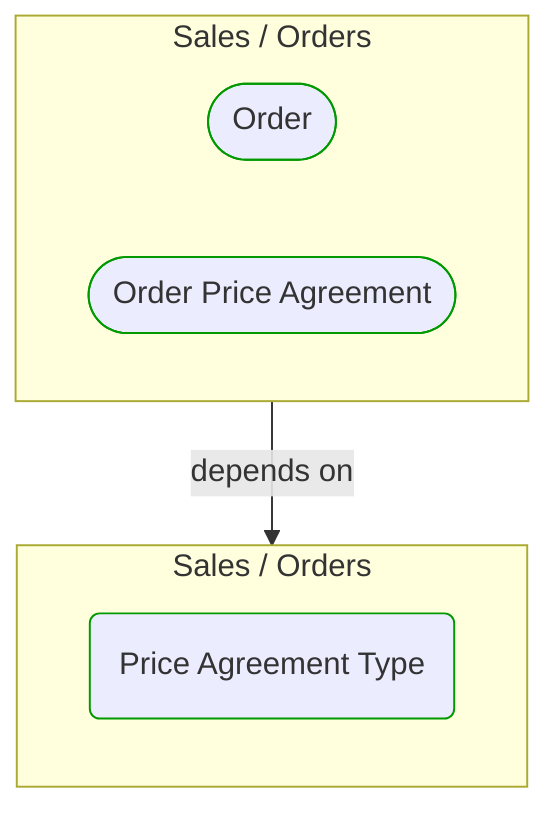


# Price Agreement Type

***Ddd Value Object***  

This view contains details information about Price Agreement Type building block, including:
- dependencies
- modules
- related processes  

---

## Domain Perspective

### Dependencies

### Related process steps

No related processes were found.  

## Next steps

### Zoom-out

#### Domain perspective

##### Domain Modules

[Sales | Orders](Orders.md)  

---

[P3 Model](https://github.com/P3-model/P3-model) documentation generated from source code using [.net tooling](https://github.com/P3-model/P3-model-dotnet)