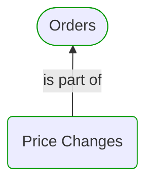
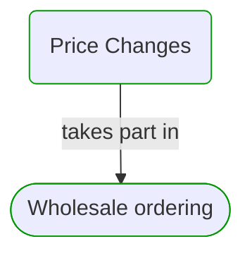
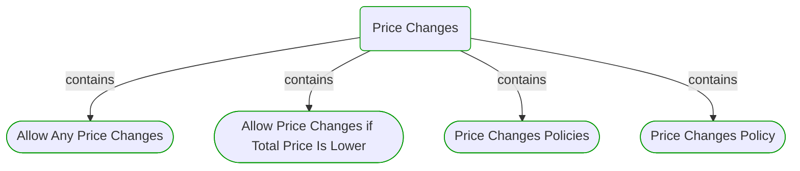
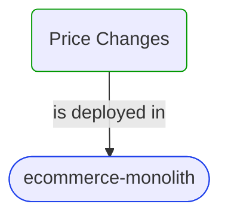
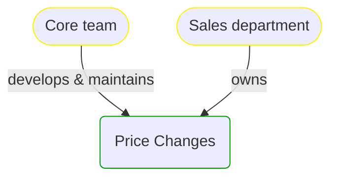


# Price Changes

***Domain Module***  

This view contains details information about Price Changes domain module, including:
- other related modules
- related processes
- related building blocks
- related deployable units
- engaged people: actors, development teams, business stakeholders  

---

## Domain Perspective

### Related modules

### Related processes

### Direct building blocks

## Technology Perspective

### Related deployable units

### Source code

- [PriceChanges](../../../../../../../../Sources/Sales/Sales.DeepModel/Orders/PriceChanges)
- [PriceChanges](../../../../../../../../Sources/Sales/Sales.IntegrationTests/Orders/PriceChanges)

## People Perspective

### Engaged people

## Next steps

### Zoom-in

#### Domain perspective

##### Ddd Domain Services

[Allow Any Price Changes](AllowAnyPriceChanges.md)  
[Allow Price Changes if Total Price Is Lower](AllowPriceChangesIfTotalPriceIsLower.md)  
[Price Changes Policy](PriceChangesPolicy.md)  

##### Ddd Factories

[Price Changes Policies](PriceChangesPolicies.md)  

##### Processes

[Wholesale ordering](../../../../Processes/WholesaleOrdering.md)  

#### Technology perspective

##### Deployable Units

[ecommerce-monolith](../../../../../Technology/DeployableUnits/EcommerceMonolith.md)  

#### People perspective

##### Business Organizational Units

[Sales department](../../../../../People/BusinessOrganizationalUnits/SalesDepartment.md)  

##### Development Teams

[Core team](../../../../../People/DevelopmentTeams/CoreTeam.md)  

### Zoom-out

#### Domain perspective

##### Domain Modules

[Sales | Orders](../Orders.md)  

---

[P3 Model](https://github.com/P3-model/P3-model) documentation generated from source code using [.net tooling](https://github.com/P3-model/P3-model-dotnet)