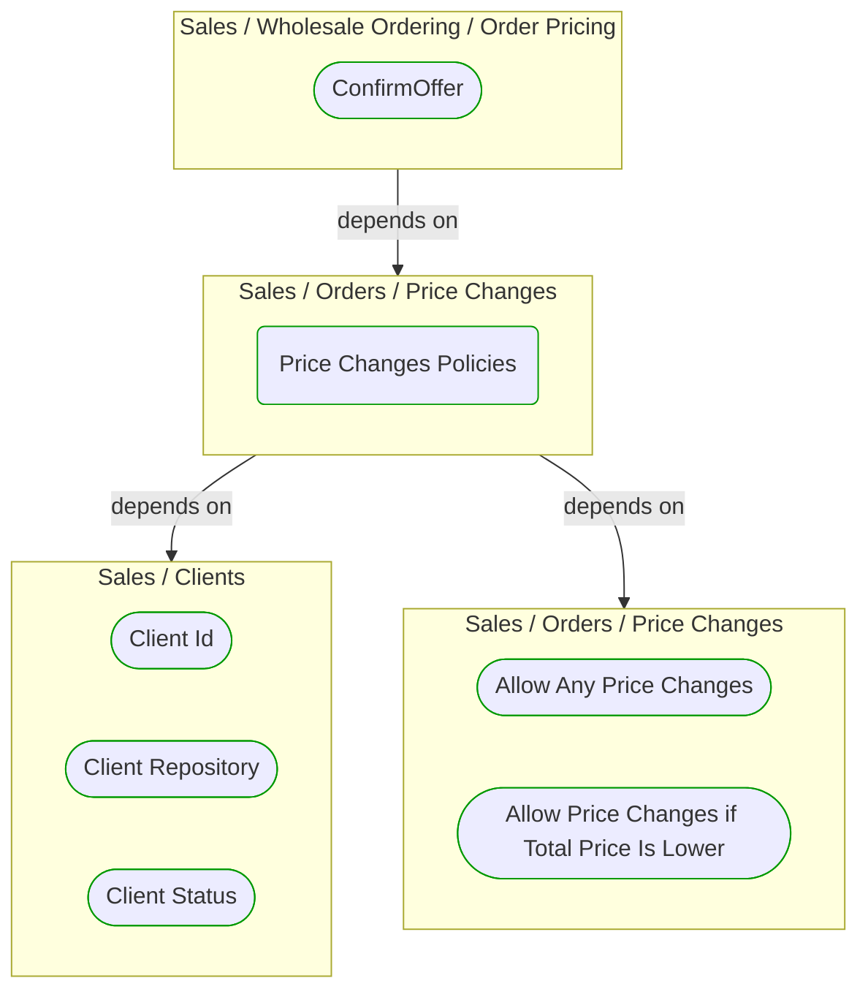
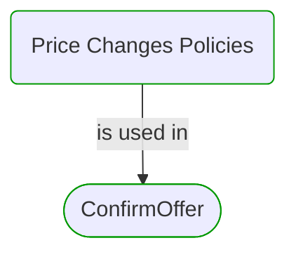


# Price Changes Policies

***Ddd Factory***  

This view contains details information about Price Changes Policies building block, including:
- dependencies
- modules
- related processes  

---

## Domain Perspective

### Dependencies

### Related process steps

## Next steps

### Zoom-in

#### Domain perspective

##### Ddd Domain Services

[Allow Any Price Changes](AllowAnyPriceChanges.md)  
[Allow Price Changes if Total Price Is Lower](AllowPriceChangesIfTotalPriceIsLower.md)  

##### Ddd Repositories

[Client Repository](../../Clients/ClientRepository.md)  

##### Ddd Value Objects

[Client Id](../../Clients/ClientId.md)  
[Client Status](../../Clients/ClientStatus.md)  

##### Process Steps

[ConfirmOffer](../../WholesaleOrdering/OrderPricing/ConfirmOffer.md)  

### Zoom-out

#### Domain perspective

##### Domain Modules

[Price Changes](PriceChanges.md)  

---

[P3 Model](https://github.com/P3-model/P3-model) documentation generated from source code using [.net tooling](https://github.com/P3-model/P3-model-dotnet)