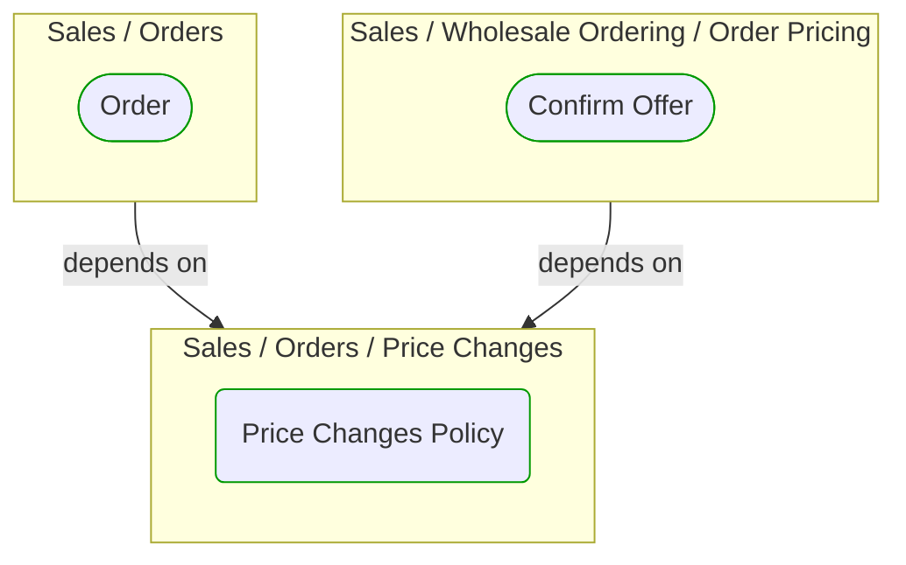
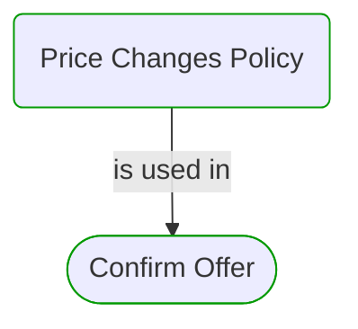


# Price Changes Policy

***Ddd Domain Service***  

This view contains details information about Price Changes Policy building block, including:
- dependencies
- modules
- related processes  

---

## Domain Perspective

### Dependencies

### Related process steps

## Next steps

### Zoom-in

#### Domain perspective

##### Process Steps

[Confirm Offer](../../WholesaleOrdering/OrderPricing/ConfirmOffer.md)  

### Zoom-out

#### Domain perspective

##### Domain Modules

[Sales | Orders | Price changes](PriceChanges.md)  

---

[P3 Model](https://github.com/P3-model/P3-model) documentation generated from source code using [.net tooling](https://github.com/P3-model/P3-model-dotnet)