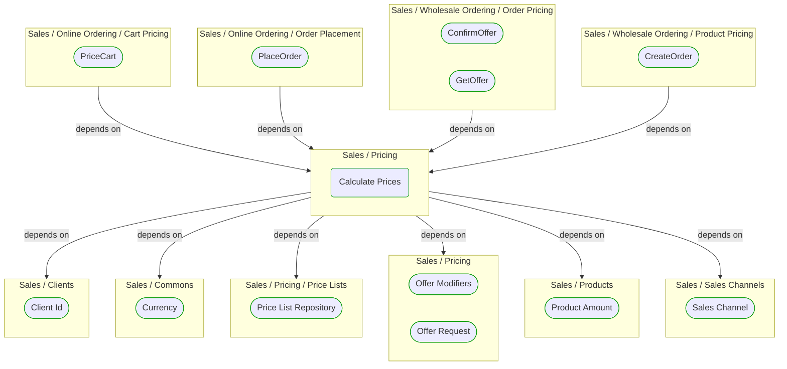
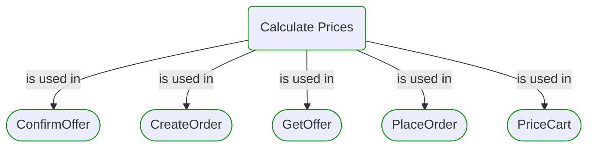


# Calculate Prices

***Ddd Domain Service***  

This view contains details information about Calculate Prices building block, including:
- dependencies
- modules
- related processes  

---

## Domain Perspective

### Dependencies

### Related process steps

## Next steps

### Zoom-in

#### Domain perspective

##### Ddd Factories

[Offer Modifiers](OfferModifiers.md)  

##### Ddd Repositories

[Price List Repository](PriceLists/PriceListRepository.md)  

##### Ddd Value Objects

[Client Id](../Clients/ClientId.md)  
[Currency](../Commons/Currency.md)  
[Offer Request](OfferRequest.md)  
[Product Amount](../Products/ProductAmount.md)  
[Sales Channel](../SalesChannels/SalesChannel.md)  

##### Process Steps

[ConfirmOffer](../WholesaleOrdering/OrderPricing/ConfirmOffer.md)  
[CreateOrder](../WholesaleOrdering/ProductPricing/CreateOrder.md)  
[GetOffer](../WholesaleOrdering/OrderPricing/GetOffer.md)  
[PlaceOrder](../OnlineOrdering/OrderPlacement/PlaceOrder.md)  
[PriceCart](../OnlineOrdering/CartPricing/PriceCart.md)  

### Zoom-out

#### Domain perspective

##### Domain Modules

[Pricing](Pricing.md)  

---

[P3 Model](https://github.com/P3-model/P3-model) documentation generated from source code using [.net tooling](https://github.com/P3-model/P3-model-dotnet)