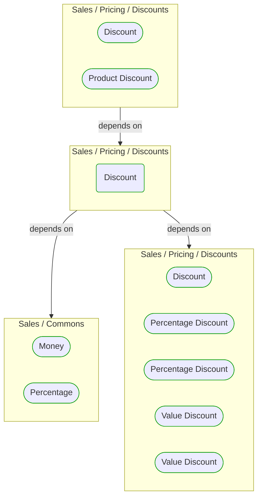

# Discount

***Ddd Domain Service***  

This view contains details information about Discount building block, including:
- dependencies
- modules
- related processes  

---

## Domain Perspective

### Dependencies

### Related process steps

No related processes were found.  

## Next steps

### Zoom-in

#### Domain perspective

##### Ddd Domain Services

[Percentage Discount](PercentageDiscount.md)  
[Value Discount](ValueDiscount.md)  

##### Ddd Value Objects

[Discount](Discount.md)  
[Money](../../Commons/Money.md)  
[Percentage](../../Commons/Percentage.md)  
[Percentage Discount](PercentageDiscount.md)  
[Value Discount](ValueDiscount.md)  

### Zoom-out

#### Domain perspective

##### Domain Modules

[Discounts](Discounts.md)  

---

[P3 Model](https://github.com/P3-model/P3-model) documentation generated from source code using [.net tooling](https://github.com/P3-model/P3-model-dotnet)