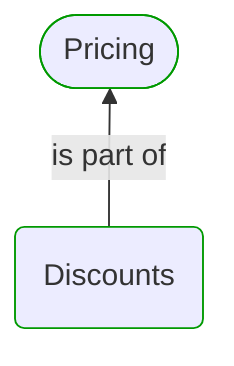
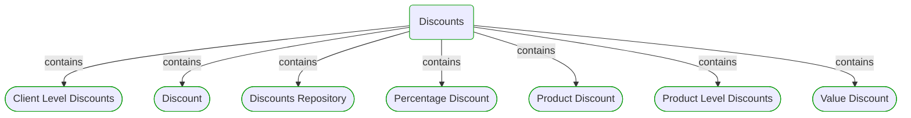
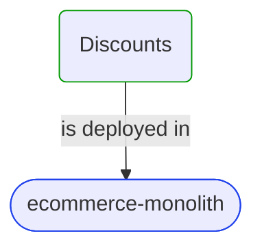
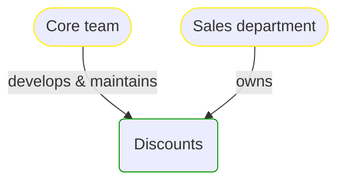


# Discounts

***Domain Module***  

This view contains details information about Discounts domain module, including:
- other related modules
- related processes
- related building blocks
- related deployable units
- engaged people: actors, development teams, business stakeholders  

---

## Domain Perspective

### Related modules

### Related processes

No related processes were found.  

### Direct building blocks

## Technology Perspective

### Related deployable units

### Source code

- [Discounts](../../../../../../../../Sources/Sales/Sales.DeepModel/Pricing/Discounts)
- [Discounts](../../../../../../../../Sources/Sales/Sales.Adapters/Pricing/Discounts)

## People Perspective

### Engaged people

## Next steps

### Zoom-in

#### Domain perspective

##### Ddd Domain Services

[Client Level Discounts](ClientLevelDiscounts.md)  
[Product Level Discounts](ProductLevelDiscounts.md)  

##### Ddd Repositories

[Discounts Repository](DiscountsRepository.md)  

##### Ddd Value Objects

[Discount](Discount.md)  
[Percentage Discount](PercentageDiscount.md)  
[Product Discount](ProductDiscount.md)  
[Value Discount](ValueDiscount.md)  

#### Technology perspective

##### Deployable Units

[ecommerce-monolith](../../../../../Technology/DeployableUnits/EcommerceMonolith.md)  

#### People perspective

##### Business Organizational Units

[Sales department](../../../../../People/BusinessOrganizationalUnits/SalesDepartment.md)  

##### Development Teams

[Core team](../../../../../People/DevelopmentTeams/CoreTeam.md)  

### Zoom-out

#### Domain perspective

##### Domain Modules

[Sales | Pricing](../Pricing.md)  

---

[P3 Model](https://github.com/P3-model/P3-model) documentation generated from source code using [.net tooling](https://github.com/P3-model/P3-model-dotnet)