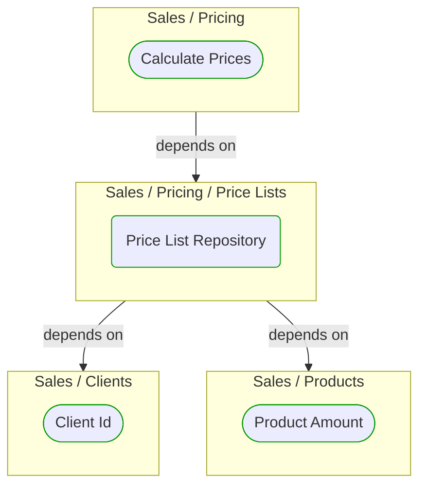


# Price List Repository

***Ddd Repository***  

This view contains details information about Price List Repository building block, including:
- dependencies
- modules
- related processes  

---

## Domain Perspective

### Dependencies

### Related process steps

No related processes were found.  

## Technology Perspective

### Source code

[PriceListRepository.cs](../../../../../../../../Sources/Sales/Sales.DeepModel/Pricing/PriceLists/PriceListRepository.cs)  

## Next steps

### Zoom-in

#### Domain perspective

##### Ddd Value Objects

[Client Id](../../Clients/ClientId.md)  
[Product Amount](../../Products/ProductAmount.md)  

### Zoom-out

#### Domain perspective

##### Domain Modules

[Sales | Pricing | Price lists](PriceLists.md)  

---

[P3 Model](https://github.com/P3-model/P3-model) documentation generated from source code using [.net tooling](https://github.com/P3-model/P3-model-dotnet)