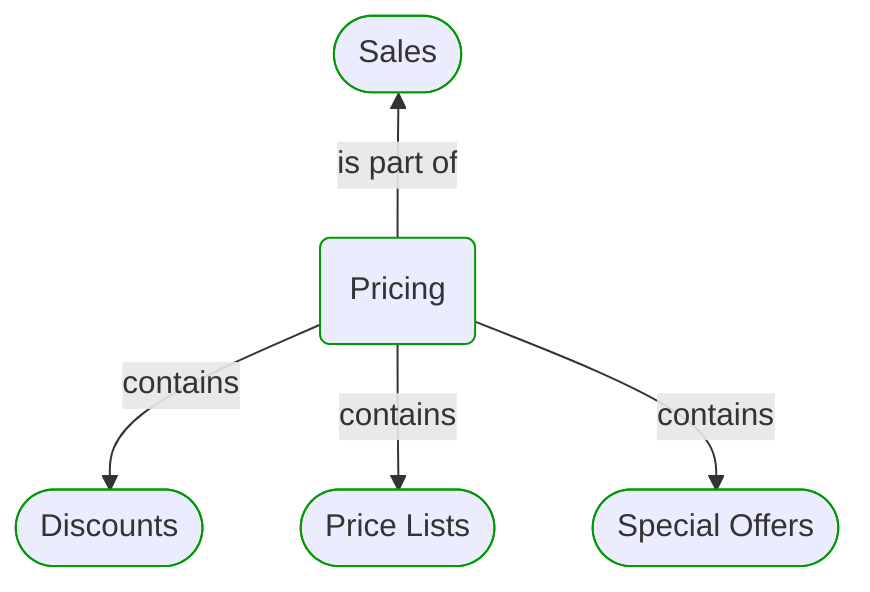
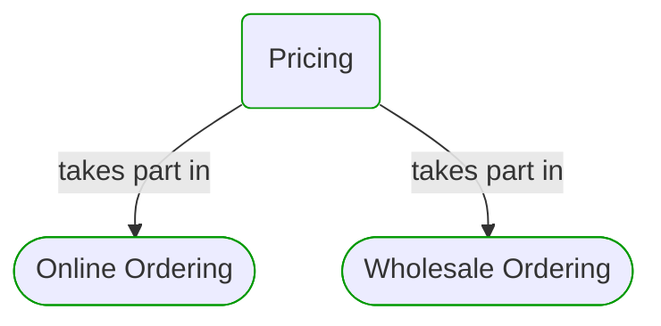
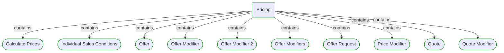
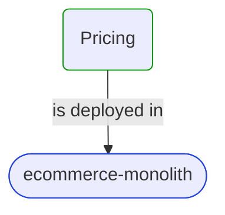
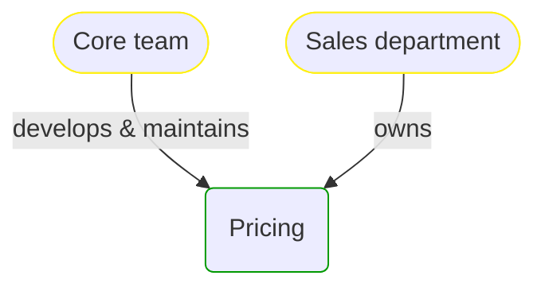


# Pricing

***Domain Module***  

This view contains details information about Pricing domain module, including:
- other related modules
- related processes
- related building blocks
- related deployable units
- engaged people: actors, development teams, business stakeholders  

---

## Domain Perspective

### Related modules

### Related processes

### Direct building blocks

## Technology Perspective

### Related deployable units

## People Perspective

### Engaged people

## Next steps

### Zoom-in

#### Domain perspective

##### Ddd Domain Services

[Calculate Prices](CalculatePrices.md)  
[Individual Sales Conditions](IndividualSalesConditions.md)  
[Offer Modifier](OfferModifier.md)  
[Offer Modifier 2](OfferModifier2.md)  
[Price Modifier](PriceModifier.md)  
[Quote Modifier](QuoteModifier.md)  

##### Ddd Factories

[Offer Modifiers](OfferModifiers.md)  

##### Ddd Value Objects

[Offer](Offer.md)  
[Offer Request](OfferRequest.md)  
[Quote](Quote.md)  

##### Domain Modules

[Discounts](Discounts/Discounts.md)  
[Price Lists](PriceLists/PriceLists.md)  
[Special Offers](SpecialOffers/SpecialOffers.md)  

##### Processes

[Online Ordering](../../../Processes/Sale/Online ordering/OnlineOrdering.md)  
[Wholesale Ordering](../../../Processes/Sale/Wholesale ordering/WholesaleOrdering.md)  

#### Technology perspective

##### Deployable Units

[ecommerce-monolith](../../../../Technology/DeployableUnits/EcommerceMonolith.md)  

#### People perspective

##### Business Organizational Units

[Sales department](../../../../People/BusinessOrganizationalUnits/SalesDepartment.md)  

##### Development Teams

[Core team](../../../../People/DevelopmentTeams/CoreTeam.md)  

### Zoom-out

#### Domain perspective

##### Domain Modules

[Sales](../Sales.md)  

---

[P3 Model](https://github.com/P3-model/P3-model) documentation generated from source code using [.net tooling](https://github.com/P3-model/P3-model-dotnet)