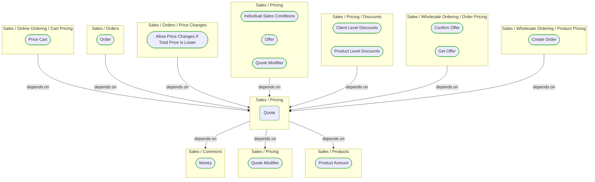
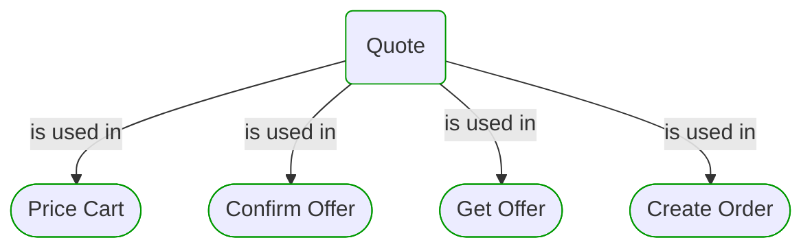

# Quote

***Ddd Value Object***  

This view contains details information about Quote building block, including:
- dependencies
- modules
- related processes  

---

## Domain Perspective

### Dependencies

### Related process steps

## Next steps

### Zoom-in

#### Domain perspective

##### Ddd Domain Services

[Quote Modifier](QuoteModifier.md)  

##### Ddd Value Objects

[Money](../Commons/Money.md)  
[Product Amount](../Products/ProductAmount.md)  

##### Process Steps

[Confirm Offer](../WholesaleOrdering/OrderPricing/ConfirmOffer.md)  
[Create Order](../WholesaleOrdering/ProductPricing/CreateOrder.md)  
[Get Offer](../WholesaleOrdering/OrderPricing/GetOffer.md)  
[Price Cart](../OnlineOrdering/CartPricing/PriceCart.md)  

### Zoom-out

#### Domain perspective

##### Domain Modules

[Pricing](Pricing.md)  

---

[P3 Model](https://github.com/P3-model/P3-model) documentation generated from source code using [.net tooling](https://github.com/P3-model/P3-model-dotnet)