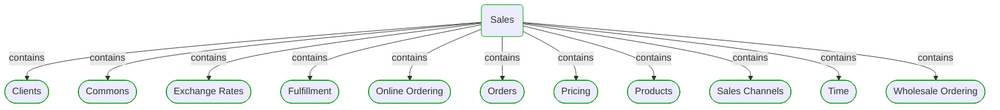

# Sales

***Domain Module***  

This view contains details information about Sales domain module, including:
- other related modules
- related processes
- related building blocks
- related deployable units
- engaged people: actors, development teams, business stakeholders  

---

## Domain Perspective

### Related modules

### Related processes

### Direct building blocks

No direct building blocks were found.  

## Technology Perspective

### Related deployable units

### Source code

- [Sales](../../../../../../Sources/Sales/Sales.ProcessModel)
- [Sales](../../../../../../Sources/Sales/Sales.RestApi/OnlineOrdering)
- [Sales](../../../../../../Sources/Sales/Sales.Adapters/Clients)
- [Sales](../../../../../../Sources/Sales/Sales.DeepModel/Clients)

## People Perspective

### Engaged people

## Next steps

### Zoom-in

#### Domain perspective

##### Domain Modules

[Sales | Clients](Clients/Clients.md)  
[Sales | Commons](Commons/Commons.md)  
[Sales | Exchange rates](ExchangeRates/ExchangeRates.md)  
[Sales | Fulfillment](Fulfillment/Fulfillment.md)  
[Sales | Online ordering](OnlineOrdering/OnlineOrdering.md)  
[Sales | Orders](Orders/Orders.md)  
[Sales | Pricing](Pricing/Pricing.md)  
[Sales | Products](Products/Products.md)  
[Sales | Sales channels](SalesChannels/SalesChannels.md)  
[Sales | Time](Time/Time.md)  
[Sales | Wholesale ordering](WholesaleOrdering/WholesaleOrdering.md)  

##### Processes

[Online ordering](../../Processes/OnlineOrdering.md)  
[Order fulfillment](../../Processes/OrderFulfillment.md)  
[Wholesale ordering](../../Processes/WholesaleOrdering.md)  

#### Technology perspective

##### Deployable Units

[ecommerce-monolith](../../../Technology/DeployableUnits/EcommerceMonolith.md)  

#### People perspective

##### Business Organizational Units

[Sales department](../../../People/BusinessOrganizationalUnits/SalesDepartment.md)  

##### Development Teams

[Core team](../../../People/DevelopmentTeams/CoreTeam.md)  

### Zoom-out

#### Domain perspective

[Domain Modules](../DomainModules.md)  

---

[P3 Model](https://github.com/P3-model/P3-model) documentation generated from source code using [.net tooling](https://github.com/P3-model/P3-model-dotnet)