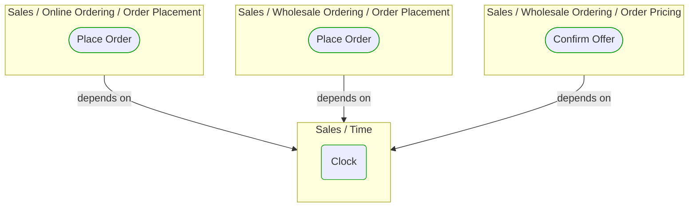
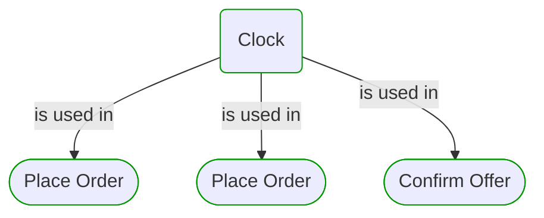


# Clock

***Ddd Domain Service***  

This view contains details information about Clock building block, including:
- dependencies
- modules
- related processes  

---

## Domain Perspective

### Dependencies

### Related process steps

## Technology Perspective

### Source code

[Clock.cs](../../../../../../../Sources/Sales/Sales.DeepModel/Time/Clock.cs)  

## Next steps

### Zoom-in

#### Domain perspective

##### Process Steps

[Confirm Offer](../WholesaleOrdering/OrderPricing/ConfirmOffer.md)  
[Place Order](../OnlineOrdering/OrderPlacement/PlaceOrder.md)  
[Place Order](../WholesaleOrdering/OrderPlacement/PlaceOrder.md)  

### Zoom-out

#### Domain perspective

##### Domain Modules

[Sales | Time](Time.md)  

---

[P3 Model](https://github.com/P3-model/P3-model) documentation generated from source code using [.net tooling](https://github.com/P3-model/P3-model-dotnet)