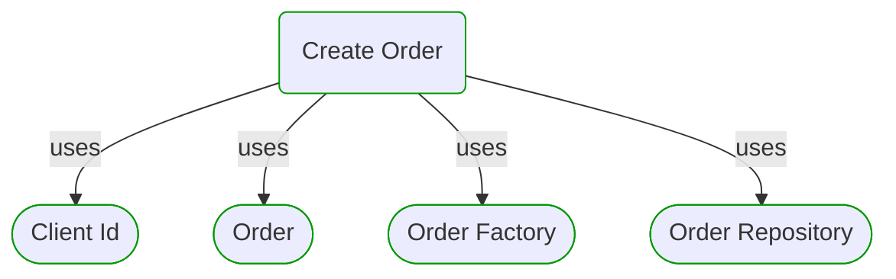
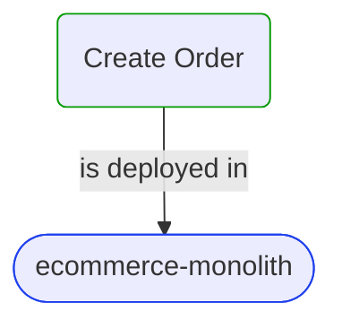
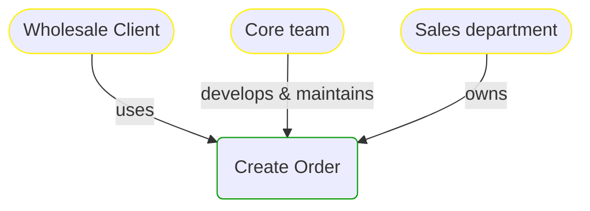


# Create Order

***Process Step***  

This view contains details information about Create Order business processes step, including:
- related process
- next process steps
- related domain module
- related deployable unit
- engaged people: actors, development teams, business stakeholders  

---

## Domain Perspective

### Process

No related process was found.  

### Used Building Blocks

## Technology Perspective

## People Perspective

## Next steps

### Zoom-in

#### Domain perspective

##### Ddd Aggregates

[Order](../../Orders/Order.md)  

##### Ddd Factories

[Order Factory](../../Orders/OrderFactory.md)  

##### Ddd Repositories

[Order Repository](../../Orders/OrderRepository.md)  

##### Ddd Value Objects

[Client Id](../../Clients/ClientId.md)  

#### Technology perspective

##### Deployable Units

[ecommerce-monolith](../../../../../Technology/DeployableUnits/EcommerceMonolith.md)  

#### People perspective

##### Business Organizational Units

[Sales department](../../../../../People/BusinessOrganizationalUnits/SalesDepartment.md)  

##### Development Teams

[Core team](../../../../../People/DevelopmentTeams/CoreTeam.md)  

### Zoom-out

#### Domain perspective

##### Domain Modules

[Sales | Wholesale ordering | Order creation](OrderCreation.md)  

---

[P3 Model](https://github.com/P3-model/P3-model) documentation generated from source code using [.net tooling](https://github.com/P3-model/P3-model-dotnet)