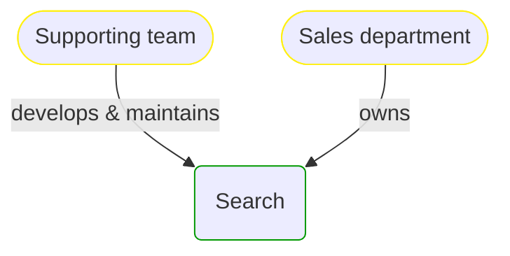


# Search

***Domain Module***  

This view contains details information about Search domain module, including:
- other related modules
- related processes
- related building blocks
- related deployable units
- engaged people: actors, development teams, business stakeholders  

---

## Domain Perspective

### Related modules

No related modules were found.  

### Related processes

No related processes were found.  

### Direct building blocks

No direct building blocks were found.  

## Technology Perspective

### Related deployable units

No related deployable units were found.  

### Source code

## People Perspective

### Engaged people

## Next steps

### Zoom-in

#### People perspective

##### Business Organizational Units

[Sales department](../../../People/BusinessOrganizationalUnits/SalesDepartment.md)  

##### Development Teams

[Supporting team](../../../People/DevelopmentTeams/SupportingTeam.md)  

### Zoom-out

#### Domain perspective

[Domain Modules](../DomainModules.md)  

---

[P3 Model](https://github.com/P3-model/P3-model) documentation generated from source code using [.net tooling](https://github.com/P3-model/P3-model-dotnet)