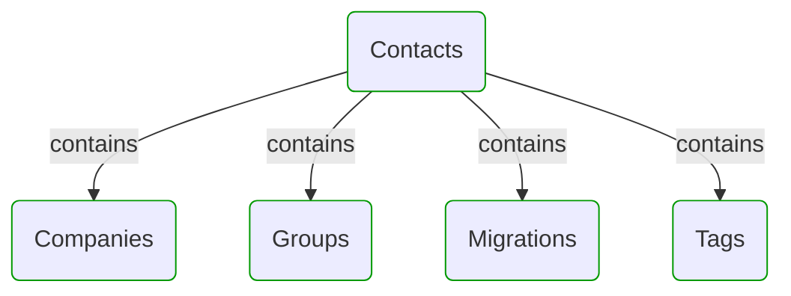
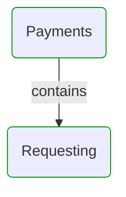
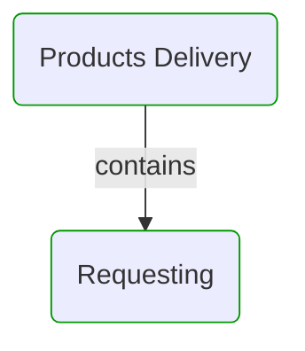
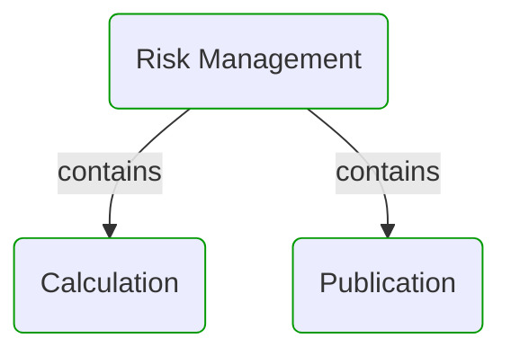
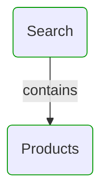


# Domain Modules

This view shows domain model modularization.  
First level modules can be treated as separate sub-models or DDD Bounded Contexts.  
All modules can be divided into sub-modules to reflect hierarchical structure of the domain.  

---

## Modules hierarchy

## Contacts

## Payments

## Products Delivery

## Risk Management

## Sales

```mermaid
  flowchart TB
    0(Sales)
    class 0 DomainPerspective
    1(Clients)
    class 1 DomainPerspective
    0-->|contains|1
    2(Commons)
    class 2 DomainPerspective
    0-->|contains|2
    3(Exchange Rates)
    class 3 DomainPerspective
    0-->|contains|3
    4(Fulfillment)
    class 4 DomainPerspective
    0-->|contains|4
    5(Integrations)
    class 5 DomainPerspective
    0-->|contains|5
    6(Payments)
    class 6 DomainPerspective
    5-->|contains|6
    7(Products Delivery)
    class 7 DomainPerspective
    5-->|contains|7
    8(Risk Management)
    class 8 DomainPerspective
    5-->|contains|8
    9(Online Ordering)
    class 9 DomainPerspective
    0-->|contains|9
    10(Cart Pricing)
    class 10 DomainPerspective
    9-->|contains|10
    11(Order Placement)
    class 11 DomainPerspective
    9-->|contains|11
    12(Orders)
    class 12 DomainPerspective
    0-->|contains|12
    13(Price Changes)
    class 13 DomainPerspective
    12-->|contains|13
    14(Pricing)
    class 14 DomainPerspective
    0-->|contains|14
    15(Discounts)
    class 15 DomainPerspective
    14-->|contains|15
    16(Price Lists)
    class 16 DomainPerspective
    14-->|contains|16
    17(Special Offers)
    class 17 DomainPerspective
    14-->|contains|17
    18(Products)
    class 18 DomainPerspective
    0-->|contains|18
    19(Sales Channels)
    class 19 DomainPerspective
    0-->|contains|19
    20(Time)
    class 20 DomainPerspective
    0-->|contains|20
    21(Wholesale Ordering)
    class 21 DomainPerspective
    0-->|contains|21
    22(Order Creation)
    class 22 DomainPerspective
    21-->|contains|22
    23(Order Modification)
    class 23 DomainPerspective
    21-->|contains|23
    24(Order Placement)
    class 24 DomainPerspective
    21-->|contains|24
    25(Order Pricing)
    class 25 DomainPerspective
    21-->|contains|25
    26(Product Pricing)
    class 26 DomainPerspective
    21-->|contains|26
    classDef DomainPerspective stroke:#009900
    classDef TechnologyPerspective stroke:#1F41EB
    classDef PeoplePerspective stroke:#FFF014
```

## Search

## Next use cases

### Zoom-in

#### Domain perspective

[Domain Module Owners](ModuleOwners.md)  

##### Domain Modules

[Contacts](Contacts/Contacts-module.md)  
[Contacts | Companies](Contacts/Companies/Companies-module.md)  
[Contacts | Groups](Contacts/Groups/Groups-module.md)  
[Contacts | Migrations](Contacts/Migrations/Migrations-module.md)  
[Contacts | Tags](Contacts/Tags/Tags-module.md)  
[Payments](Payments/Payments-module.md)  
[Payments | Requesting](Payments/Requesting/Requesting-module.md)  
[Products delivery](ProductsDelivery/ProductsDelivery-module.md)  
[Products delivery | Requesting](ProductsDelivery/Requesting/Requesting-module.md)  
[Risk management](RiskManagement/RiskManagement-module.md)  
[Risk management | Calculation](RiskManagement/Calculation/Calculation-module.md)  
[Risk management | Publication](RiskManagement/Publication/Publication-module.md)  
[Sales](Sales/Sales-module.md)  
[Sales | Clients](Sales/Clients/Clients-module.md)  
[Sales | Commons](Sales/Commons/Commons-module.md)  
[Sales | Exchange rates](Sales/ExchangeRates/ExchangeRates-module.md)  
[Sales | Fulfillment](Sales/Fulfillment/Fulfillment-module.md)  
[Sales | Integrations](Sales/Integrations/Integrations-module.md)  
[Sales | Integrations | Payments](Sales/Integrations/Payments/Payments-module.md)  
[Sales | Integrations | Products delivery](Sales/Integrations/ProductsDelivery/ProductsDelivery-module.md)  
[Sales | Integrations | Risk management](Sales/Integrations/RiskManagement/RiskManagement-module.md)  
[Sales | Online ordering](Sales/OnlineOrdering/OnlineOrdering-module.md)  
[Sales | Online ordering | Cart pricing](Sales/OnlineOrdering/CartPricing/CartPricing-module.md)  
[Sales | Online ordering | Order placement](Sales/OnlineOrdering/OrderPlacement/OrderPlacement-module.md)  
[Sales | Orders](Sales/Orders/Orders-module.md)  
[Sales | Orders | Price changes](Sales/Orders/PriceChanges/PriceChanges-module.md)  
[Sales | Pricing](Sales/Pricing/Pricing-module.md)  
[Sales | Pricing | Discounts](Sales/Pricing/Discounts/Discounts-module.md)  
[Sales | Pricing | Price lists](Sales/Pricing/PriceLists/PriceLists-module.md)  
[Sales | Pricing | Special offers](Sales/Pricing/SpecialOffers/SpecialOffers-module.md)  
[Sales | Products](Sales/Products/Products-module.md)  
[Sales | Sales channels](Sales/SalesChannels/SalesChannels-module.md)  
[Sales | Time](Sales/Time/Time-module.md)  
[Sales | Wholesale ordering](Sales/WholesaleOrdering/WholesaleOrdering-module.md)  
[Sales | Wholesale ordering | Order creation](Sales/WholesaleOrdering/OrderCreation/OrderCreation-module.md)  
[Sales | Wholesale ordering | Order modification](Sales/WholesaleOrdering/OrderModification/OrderModification-module.md)  
[Sales | Wholesale ordering | Order placement](Sales/WholesaleOrdering/OrderPlacement/OrderPlacement-module.md)  
[Sales | Wholesale ordering | Order pricing](Sales/WholesaleOrdering/OrderPricing/OrderPricing-module.md)  
[Sales | Wholesale ordering | Product pricing](Sales/WholesaleOrdering/ProductPricing/ProductPricing-module.md)  
[Search](Search/Search-module.md)  
[Search | Products](Search/Products/Products-module.md)  

### Zoom-out

#### Multi perspectives

[Main page](../../README.md)  

---

[P3 Model](https://github.com/P3-model/P3-model) documentation generated from source code using [.net tooling](https://github.com/P3-model/P3-model-dotnet)