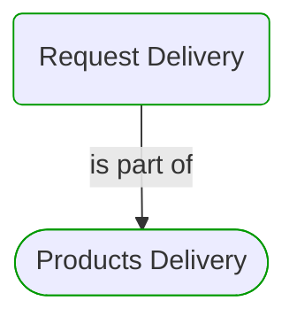
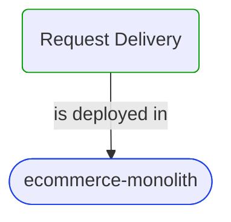


# Request Delivery

***Use Case***  

This view contains details information about Request Delivery use case, including:
- related process
- related domain module
- related deployable unit
- engaged people: actors, development teams, business stakeholders  

---

## Domain Perspective

### Process

### Used Building Blocks

No building blocks were found. Maybe this use case is not implemented yet?  

## Technology Perspective

### Source code

No source code files were found.  

## People Perspective

No engaged people were found.  

## Next use cases

### Zoom-in

#### Technology perspective

##### Deployable Units

[ecommerce-monolith](../../../../Technology/DeployableUnits/EcommerceMonolith.md)  

### Zoom-out

#### Domain perspective

##### Domain Modules

[Products delivery | Requesting](Requesting-module.md)  

##### Processes

[Products Delivery](../../../Processes/ProductsDelivery.md)  

---

[P3 Model](https://github.com/P3-model/P3-model) documentation generated from source code using [.net tooling](https://github.com/P3-model/P3-model-dotnet)