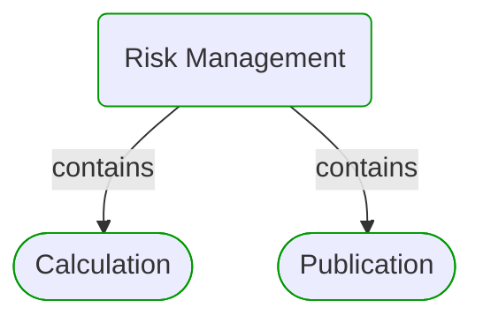
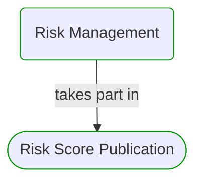
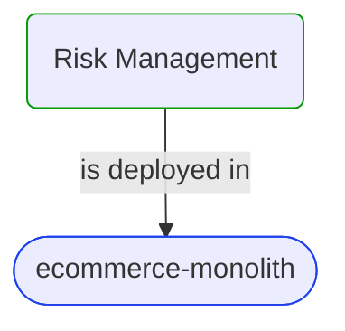


# Risk Management

***Domain Module***  

This view contains details information about Risk Management domain module, including:
- other related modules
- related processes
- related building blocks
- related deployable units
- engaged people: actors, development teams, business stakeholders  

---

## Domain Perspective

### Related modules

### Related processes

### Direct building blocks

No direct building blocks were found.  

## Technology Perspective

### Related deployable units

### Source code

No source code files were found.  

## People Perspective

### Engaged people

No engaged people were found.  

## Next use cases

### Zoom-in

#### Domain perspective

##### Domain Modules

[Risk management | Calculation](Calculation/Calculation-module.md)  
[Risk management | Publication](Publication/Publication-module.md)  

##### Processes

[Risk Score Publication](../../Processes/RiskScorePublication.md)  

#### Technology perspective

##### Deployable Units

[ecommerce-monolith](../../../Technology/DeployableUnits/EcommerceMonolith.md)  

### Zoom-out

#### Domain perspective

[Domain Modules](../Modules.md)  

---

[P3 Model](https://github.com/P3-model/P3-model) documentation generated from source code using [.net tooling](https://github.com/P3-model/P3-model-dotnet)