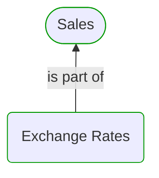
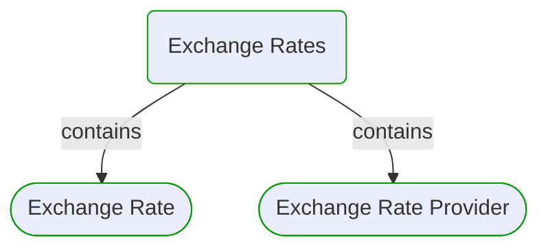
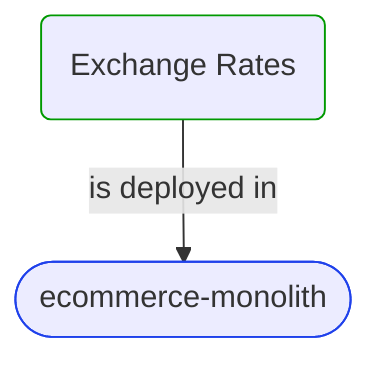

# Exchange Rates

***Domain Module***  

This view contains details information about Exchange Rates domain module, including:
- other related modules
- related processes
- related building blocks
- related deployable units
- engaged people: actors, development teams, business stakeholders  

---

## Domain Perspective

### Related modules

### Related processes

No related processes were found.  

### Direct building blocks

## Technology Perspective

### Related deployable units

### Source code

No source code files were found.  

## People Perspective

### Engaged people

No engaged people were found.  

## Next use cases

### Zoom-in

#### Domain perspective

##### Ddd Value Objects

[Exchange Rate](ExchangeRate.md)  

##### External System Integrations

[Exchange Rate Provider](ExchangeRateProvider.md)  

#### Technology perspective

##### Deployable Units

[ecommerce-monolith](../../../../Technology/DeployableUnits/EcommerceMonolith.md)  

### Zoom-out

#### Domain perspective

##### Domain Modules

[Sales](../Sales-module.md)  

---

[P3 Model](https://github.com/P3-model/P3-model) documentation generated from source code using [.net tooling](https://github.com/P3-model/P3-model-dotnet)