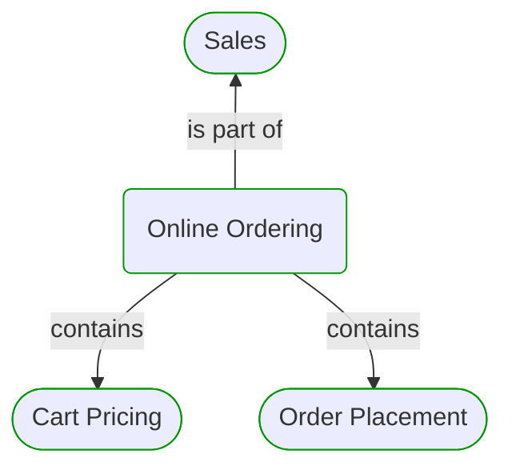
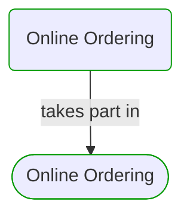
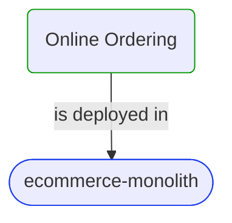
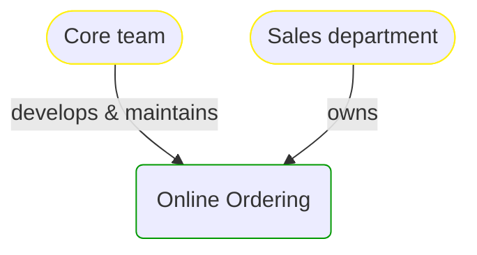


# Online Ordering

***Domain Module***  

This view contains details information about Online Ordering domain module, including:
- other related modules
- related processes
- related building blocks
- related deployable units
- engaged people: actors, development teams, business stakeholders  

---

## Domain Perspective

### Related modules

### Related processes

### Direct building blocks

No direct building blocks were found.  

## Technology Perspective

### Related deployable units

### Source code

No source code files were found.  

## People Perspective

### Engaged people

## Next use cases

### Zoom-in

#### Domain perspective

##### Domain Modules

[Sales | Online ordering | Cart pricing](CartPricing/CartPricing-module.md)  
[Sales | Online ordering | Order placement](OrderPlacement/OrderPlacement-module.md)  

##### Processes

[Online Ordering](../../../Processes/OnlineOrdering.md)  

#### Technology perspective

##### Deployable Units

[ecommerce-monolith](../../../../Technology/DeployableUnits/EcommerceMonolith.md)  

#### People perspective

##### Business Organizational Units

[Sales department](../../../../People/BusinessOrganizationalUnits/SalesDepartment.md)  

##### Development Teams

[Core team](../../../../People/DevelopmentTeams/CoreTeam.md)  

### Zoom-out

#### Domain perspective

##### Domain Modules

[Sales](../Sales-module.md)  

---

[P3 Model](https://github.com/P3-model/P3-model) documentation generated from source code using [.net tooling](https://github.com/P3-model/P3-model-dotnet)