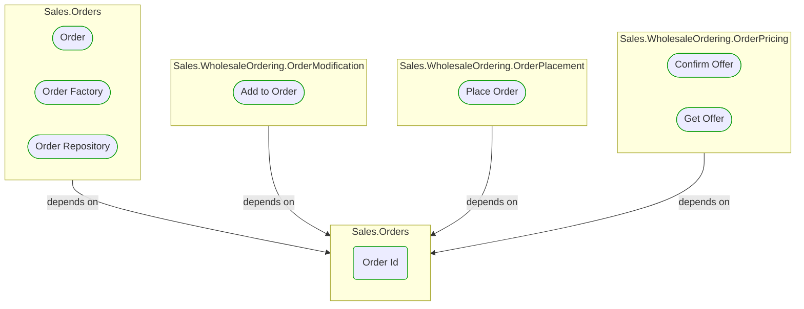
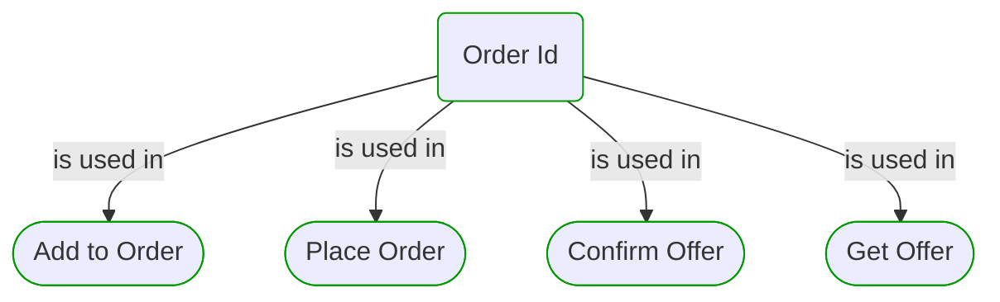


# Order Id

***Ddd Value Object***  

This view contains details information about Order Id building block, including:
- dependencies
- modules
- related processes  

---

## Domain Perspective

### Dependencies

### Related use cases

## Technology Perspective

### Source code

No source code files were found.  

## Next use cases

### Zoom-in

#### Domain perspective

##### Use Cases

[Add to Order](../WholesaleOrdering/OrderModification/AddToOrder.md)  
[Confirm Offer](../WholesaleOrdering/OrderPricing/ConfirmOffer.md)  
[Get Offer](../WholesaleOrdering/OrderPricing/GetOffer.md)  
[Place Order](../WholesaleOrdering/OrderPlacement/PlaceOrder.md)  

### Zoom-out

#### Domain perspective

##### Domain Modules

[Sales | Orders](Orders-module.md)  

---

[P3 Model](https://github.com/P3-model/P3-model) documentation generated from source code using [.net tooling](https://github.com/P3-model/P3-model-dotnet)