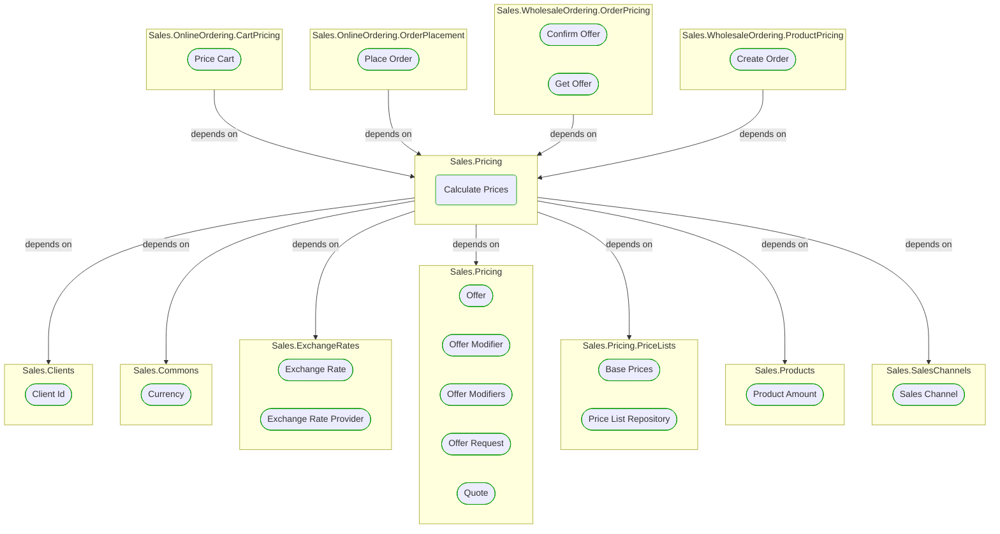
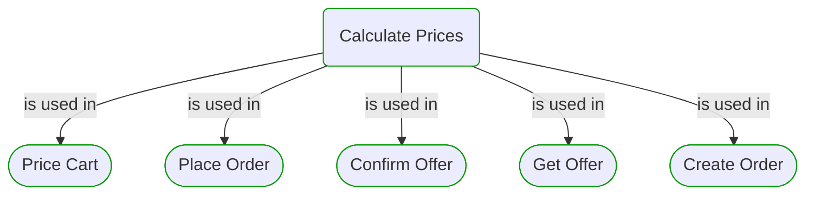


# Calculate Prices

***Ddd Domain Service***  

This view contains details information about Calculate Prices building block, including:
- dependencies
- modules
- related processes  

---

## Domain Perspective

### Dependencies

### Related use cases

## Technology Perspective

### Source code

No source code files were found.  

## Next use cases

### Zoom-in

#### Domain perspective

##### Ddd Domain Services

[Offer Modifier](OfferModifier.md)  

##### Ddd Factories

[Offer Modifiers](OfferModifiers.md)  

##### Ddd Repositories

[Price List Repository](PriceLists/PriceListRepository.md)  

##### Ddd Value Objects

[Base Prices](PriceLists/BasePrices.md)  
[Client Id](../Clients/ClientId.md)  
[Currency](../Commons/Currency.md)  
[Exchange Rate](../ExchangeRates/ExchangeRate.md)  
[Offer](Offer.md)  
[Offer Request](OfferRequest.md)  
[Product Amount](../Products/ProductAmount.md)  
[Quote](Quote.md)  
[Sales Channel](../SalesChannels/SalesChannel.md)  

##### External System Integrations

[Exchange Rate Provider](../ExchangeRates/ExchangeRateProvider.md)  

##### Use Cases

[Confirm Offer](../WholesaleOrdering/OrderPricing/ConfirmOffer.md)  
[Create Order](../WholesaleOrdering/ProductPricing/CreateOrder.md)  
[Get Offer](../WholesaleOrdering/OrderPricing/GetOffer.md)  
[Place Order](../OnlineOrdering/OrderPlacement/PlaceOrder.md)  
[Price Cart](../OnlineOrdering/CartPricing/PriceCart.md)  

### Zoom-out

#### Domain perspective

##### Domain Modules

[Sales | Pricing](Pricing-module.md)  

---

[P3 Model](https://github.com/P3-model/P3-model) documentation generated from source code using [.net tooling](https://github.com/P3-model/P3-model-dotnet)