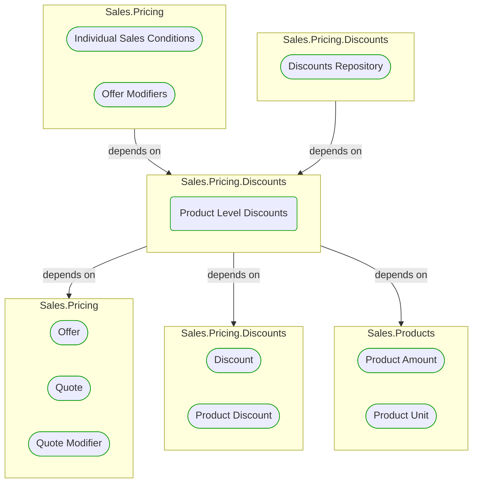


# Product Level Discounts

***Ddd Domain Service***  

This view contains details information about Product Level Discounts building block, including:
- dependencies
- modules
- related processes  

---

## Domain Perspective

### Dependencies

### Related use cases

No related processes were found.  

## Technology Perspective

### Source code

No source code files were found.  

## Next use cases

### Zoom-in

#### Domain perspective

##### Ddd Domain Services

[Quote Modifier](../QuoteModifier.md)  

##### Ddd Value Objects

[Discount](Discount.md)  
[Offer](../Offer.md)  
[Product Amount](../../Products/ProductAmount.md)  
[Product Discount](ProductDiscount.md)  
[Product Unit](../../Products/ProductUnit.md)  
[Quote](../Quote.md)  

### Zoom-out

#### Domain perspective

##### Domain Modules

[Sales | Pricing | Discounts](Discounts-module.md)  

---

[P3 Model](https://github.com/P3-model/P3-model) documentation generated from source code using [.net tooling](https://github.com/P3-model/P3-model-dotnet)