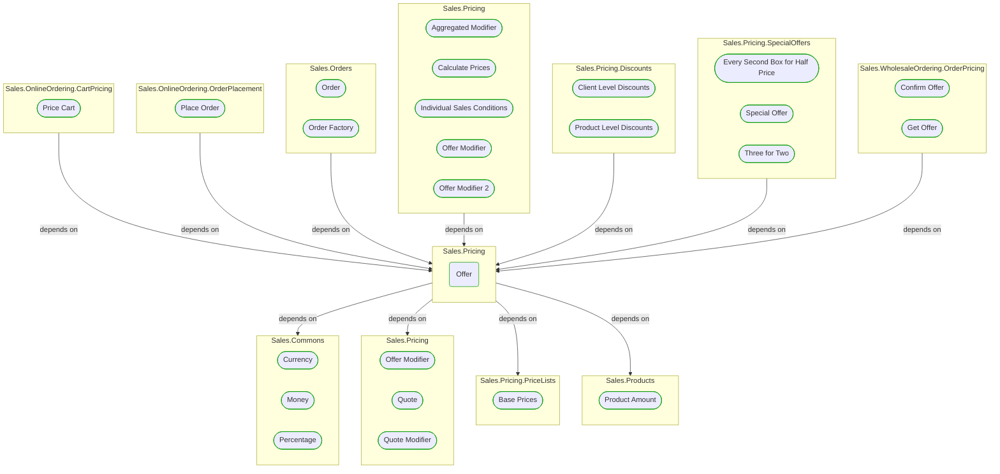
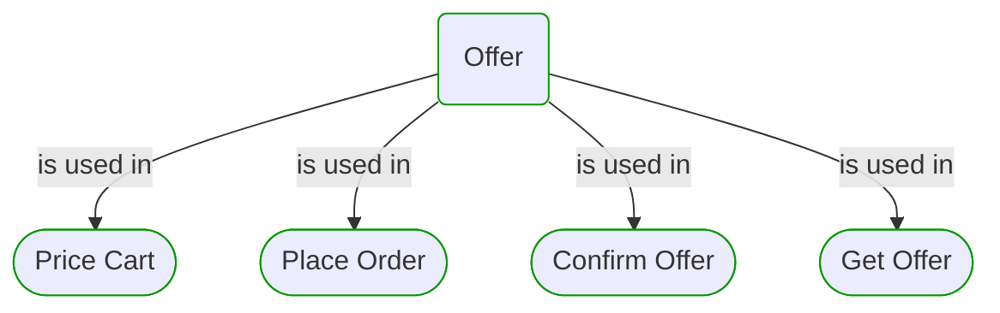


# Offer

***Ddd Value Object***  

This view contains details information about Offer building block, including:
- dependencies
- modules
- related processes  

---

## Domain Perspective

### Dependencies

### Related use cases

## Technology Perspective

### Source code

No source code files were found.  

## Next use cases

### Zoom-in

#### Domain perspective

##### Ddd Domain Services

[Offer Modifier](OfferModifier.md)  
[Quote Modifier](QuoteModifier.md)  

##### Ddd Value Objects

[Base Prices](PriceLists/BasePrices.md)  
[Currency](../Commons/Currency.md)  
[Money](../Commons/Money.md)  
[Percentage](../Commons/Percentage.md)  
[Product Amount](../Products/ProductAmount.md)  
[Quote](Quote.md)  

##### Use Cases

[Confirm Offer](../WholesaleOrdering/OrderPricing/ConfirmOffer.md)  
[Get Offer](../WholesaleOrdering/OrderPricing/GetOffer.md)  
[Place Order](../OnlineOrdering/OrderPlacement/PlaceOrder.md)  
[Price Cart](../OnlineOrdering/CartPricing/PriceCart.md)  

### Zoom-out

#### Domain perspective

##### Domain Modules

[Sales | Pricing](Pricing-module.md)  

---

[P3 Model](https://github.com/P3-model/P3-model) documentation generated from source code using [.net tooling](https://github.com/P3-model/P3-model-dotnet)