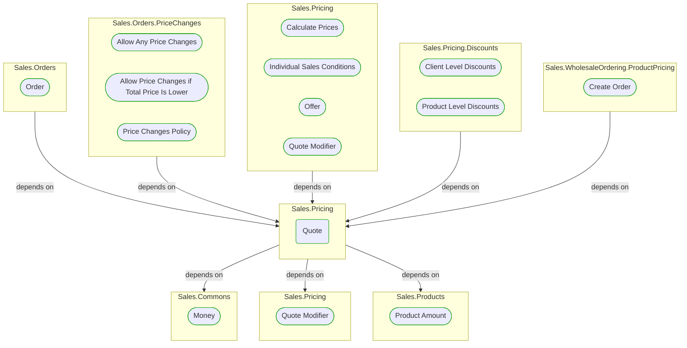
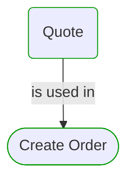


# Quote

***Ddd Value Object***  

This view contains details information about Quote building block, including:
- dependencies
- modules
- related processes  

---

## Domain Perspective

### Dependencies

### Related use cases

## Technology Perspective

### Source code

No source code files were found.  

## Next use cases

### Zoom-in

#### Domain perspective

##### Ddd Domain Services

[Quote Modifier](QuoteModifier.md)  

##### Ddd Value Objects

[Money](../Commons/Money.md)  
[Product Amount](../Products/ProductAmount.md)  

##### Use Cases

[Create Order](../WholesaleOrdering/ProductPricing/CreateOrder.md)  

### Zoom-out

#### Domain perspective

##### Domain Modules

[Sales | Pricing](Pricing-module.md)  

---

[P3 Model](https://github.com/P3-model/P3-model) documentation generated from source code using [.net tooling](https://github.com/P3-model/P3-model-dotnet)