# Sales

***Domain Module***  

This view contains details information about Sales domain module, including:
- other related modules
- related processes
- related building blocks
- related deployable units
- engaged people: actors, development teams, business stakeholders  

---

## Domain Perspective

### Related modules

```mermaid
  flowchart TB
    0(Sales)
    class 0 DomainPerspective
    1([Clients])
    class 1 DomainPerspective
    0-->|contains|1
    2([Commons])
    class 2 DomainPerspective
    0-->|contains|2
    3([Exchange Rates])
    class 3 DomainPerspective
    0-->|contains|3
    4([Fulfillment])
    class 4 DomainPerspective
    0-->|contains|4
    5([Integrations])
    class 5 DomainPerspective
    0-->|contains|5
    6([Online Ordering])
    class 6 DomainPerspective
    0-->|contains|6
    7([Orders])
    class 7 DomainPerspective
    0-->|contains|7
    8([Pricing])
    class 8 DomainPerspective
    0-->|contains|8
    9([Products])
    class 9 DomainPerspective
    0-->|contains|9
    10([Sales Channels])
    class 10 DomainPerspective
    0-->|contains|10
    11([Time])
    class 11 DomainPerspective
    0-->|contains|11
    12([Wholesale Ordering])
    class 12 DomainPerspective
    0-->|contains|12
    classDef DomainPerspective stroke:#009900
    classDef TechnologyPerspective stroke:#1F41EB
    classDef PeoplePerspective stroke:#FFF014
```

### Related processes

### Direct building blocks

No direct building blocks were found.  

## Technology Perspective

### Related deployable units

### Source code

No source code files were found.  

## People Perspective

### Engaged people

No engaged people were found.  

## Next use cases

### Zoom-in

#### Domain perspective

##### Domain Modules

[Sales | Clients](Clients/Clients-module.md)  
[Sales | Commons](Commons/Commons-module.md)  
[Sales | Exchange rates](ExchangeRates/ExchangeRates-module.md)  
[Sales | Fulfillment](Fulfillment/Fulfillment-module.md)  
[Sales | Integrations](Integrations/Integrations-module.md)  
[Sales | Online ordering](OnlineOrdering/OnlineOrdering-module.md)  
[Sales | Orders](Orders/Orders-module.md)  
[Sales | Pricing](Pricing/Pricing-module.md)  
[Sales | Products](Products/Products-module.md)  
[Sales | Sales channels](SalesChannels/SalesChannels-module.md)  
[Sales | Time](Time/Time-module.md)  
[Sales | Wholesale ordering](WholesaleOrdering/WholesaleOrdering-module.md)  

##### Processes

[Online Ordering](../../Processes/OnlineOrdering.md)  
[Order Fulfillment](../../Processes/OrderFulfillment.md)  
[Wholesale Ordering](../../Processes/WholesaleOrdering.md)  

#### Technology perspective

##### Deployable Units

[ecommerce-monolith](../../../Technology/DeployableUnits/EcommerceMonolith.md)  

### Zoom-out

#### Domain perspective

[Domain Modules](../Modules.md)  

---

[P3 Model](https://github.com/P3-model/P3-model) documentation generated from source code using [.net tooling](https://github.com/P3-model/P3-model-dotnet)