
# Business Processes

This view contains all business processes  

---

```mermaid
  flowchart TB
    0(Online ordering)
    class 0 DomainPerspective
    1(Order fulfillment)
    class 1 DomainPerspective
    2(Payment)
    class 2 DomainPerspective
    3(Products delivery)
    class 3 DomainPerspective
    4(Risk management)
    class 4 DomainPerspective
    5(Risk score calculation)
    class 5 DomainPerspective
    6(Risk score publication)
    class 6 DomainPerspective
    7(Sale)
    class 7 DomainPerspective
    8(Wholesale ordering)
    class 8 DomainPerspective
    classDef DomainPerspective stroke:#009900
    classDef TechnologyPerspective stroke:#1F41EB
    classDef PeoplePerspective stroke:#FFF014
```

## Next steps

### Zoom-in

#### Domain perspective

##### Processes

[Online ordering](OnlineOrdering.md)  
[Order fulfillment](OrderFulfillment.md)  
[Payment](Payment.md)  
[Products delivery](ProductsDelivery.md)  
[Risk management](RiskManagement.md)  
[Risk score calculation](RiskScoreCalculation.md)  
[Risk score publication](RiskScorePublication.md)  
[Sale](Sale.md)  
[Wholesale ordering](WholesaleOrdering.md)  

### Zoom-out

#### Multi perspectives

[Main page](../../README.md)  

---

[P3 Model](https://github.com/P3-model/P3-model) documentation generated from source code using [.net tooling](https://github.com/P3-model/P3-model-dotnet)