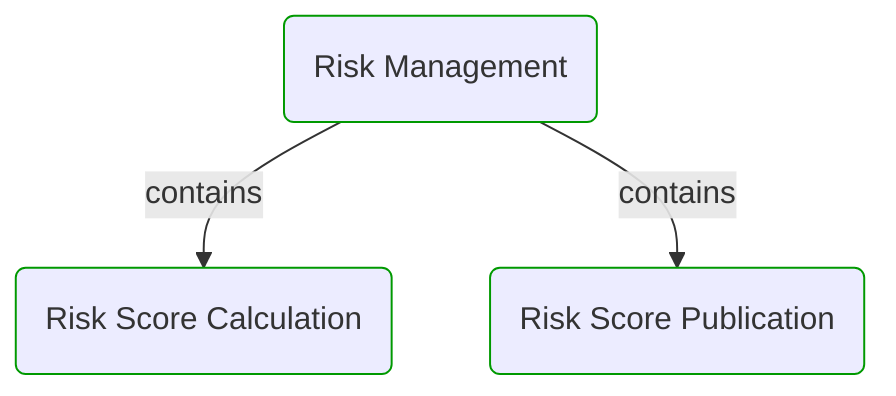
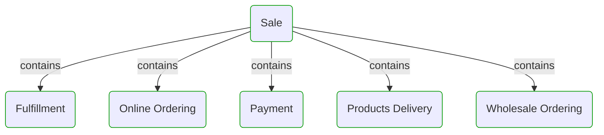


# Business Processes

This view contains all business processes with their sub-processes.  

---

## Risk Management

## Sale

## Next steps

### Zoom-in

#### Domain perspective

##### Processes

[Fulfillment](Sale/Fulfillment/Fulfillment.md)  
[Online Ordering](Sale/Online ordering/OnlineOrdering.md)  
[Payment](Sale/Payment/Payment.md)  
[Products Delivery](Sale/Products delivery/ProductsDelivery.md)  
[Risk Management](Risk management/RiskManagement.md)  
[Risk Score Calculation](Risk management/Risk score calculation/RiskScoreCalculation.md)  
[Risk Score Publication](Risk management/Risk score publication/RiskScorePublication.md)  
[Sale](Sale/Sale.md)  
[Wholesale Ordering](Sale/Wholesale ordering/WholesaleOrdering.md)  

### Zoom-out

#### Multi perspectives

[Main page](../../README.md)  

---

[P3 Model](https://github.com/P3-model/P3-model) documentation generated from source code using [.net tooling](https://github.com/P3-model/P3-model-dotnet)